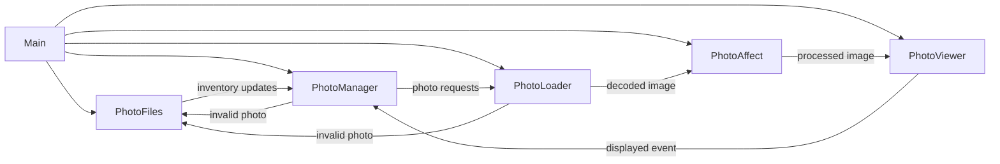

# Photo Frame

A digital photo frame driver implemented in Rust with a pipeline tuned for Raspberry Pi hardware. Watches a photo library, weights the playlist so new images appear more frequently, and renders each slide with configurable matting, transitions, and photo effects.

**Built for:** Raspberry Pi hobbyists, makers or photographers who want a bespoke display, and Rust developers interested in embedded graphics pipelines.

**Highlights:**

- Runs entirely on-device with a configurable playlist weighting system.
- Supports rich visual treatments (mats, transitions, print simulation) without requiring graphics expertise.

## Table of Contents

1. [Hardware](#hardware)
2. [Software Setup](#software-setup)
3. [Features](#features)
4. [Architecture Overview](#architecture-overview)
5. [Configuration](#configuration)
6. [Fabrication](#fabrication)
7. [References](#references)
8. [License](#license)

## Hardware

Plan your build around a Raspberry Pi 5, a portrait-capable 4K monitor, and mounting hardware that hides cables while keeping airflow open. The dedicated hardware guide covers the recommended bill of materials plus optional accessories and planning tips. [Full details →](docs/hardware.md)

## Software Setup

From flashing Raspberry Pi OS to deploying the watcher, hotspot, and sync services, the setup guide walks through every command you need to bring the slideshow online. It also documents CLI flags for local debugging and a quickstart checklist for provisioning. [Full details →](docs/software-setup.md)

## Features

- Recursively scans a configurable photo library directory
  - Detects changes from external synchronization processes
    - Automatically adds new photos to the playlist
    - Removes deleted photos from the playlist
  - Prioritizes newer photos with user-configurable display rates
- Configurable matting, transitions, and photo effects
- Supports multiple image formats: JPG, PNG, GIF, WebP, BMP, TIFF
- Robust error handling with structured logging

## Architecture Overview

Curious how the frame stays responsive? This optional deep dive outlines the async tasks and their communication patterns. Skip ahead to [Configuration](#configuration) if you just want to tune the experience.

The runtime is composed of five asynchronous tasks orchestrated by `main.rs`. They communicate over bounded channels to keep memory predictable and to respect GPU/CPU parallelism limits.

## Configuration

All configuration options—from playlist weighting and greeting screens to transition tuning—are documented in depth, including starter YAML examples and per-key reference tables. [Full details →](docs/configuration.md)

## Fabrication

Plan the physical build of the frame with dedicated fabrication guidance that covers laser cutting, 3D-printed brackets, cabinetry, and a final assembly checklist. [Full details →](docs/fabrication.md)

## References

- **Procedural studio mat weave texture.** Our weave shading is adapted from Mike Cauchi’s breakdown of tillable cloth shading, which layers sine-profiled warp/weft threads with randomized grain to keep the pattern from banding. See ["Research – Tillable Images and Cloth Shading"](https://www.mikecauchiart.com/single-post/2017/01/23/research-tillable-images-and-cloth-shading).
- **Print simulation shading.** The gallery-lighting and relief model follows guidance from Rohit A. Patil, Mark D. Fairchild, and Garrett M. Johnson’s paper ["3D Simulation of Prints for Improved Soft Proofing"](https://doi.org/10.1117/12.813471).

## License

This project is licensed under the **MIT License**.
See the [LICENSE](LICENSE) file for full text.

### Third-Party Assets

This project may bundle fonts licensed under the SIL Open Font License (OFL) 1.1.

- Inconsolata (example font for UI text)
  - License: SIL OFL 1.1
  - License text: `assets/fonts/OFL.txt`
  - Notes: The font remains under OFL, which permits bundling with MIT-licensed code. If the font is modified, the Reserved Font Name rules apply.

© 2025 Vincent Lucarelli
