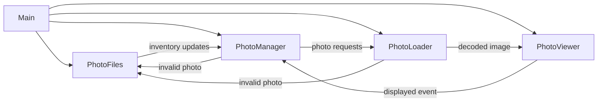

# Photoframe

A Rust-based digital photo frame pipeline tuned for Raspberry Pi hardware. It watches your photo library, weights the playlist so new images appear more frequently, and renders each slide with configurable matting and transitions.

## Project Status

This project is **alpha and under active development**. Expect rough edges and incomplete documentation.

## Table of Contents

1. [Quickstart](#quickstart)
2. [Architecture Overview](#architecture-overview)
3. [Features](#features)
4. [Configuration](#configuration)
5. [Playlist Weighting](#playlist-weighting)
6. [Matting Configuration](#matting-configuration)
7. [License](#license)

## Quickstart

### Prerequisites _(TODO: document Raspberry Pi OS version, GPU requirements, and external dependencies)_

### Build & Run

```bash
cargo run --release -- <path/to/config.yaml>
```

The binary accepts several optional CLI flags for playlist testing and determinism:

| Flag | Description |
| --- | --- |
| `--playlist-now <RFC3339>` | Overrides `SystemTime::now()` when computing playlist weights. Useful for reproducible simulations. |
| `--playlist-dry-run <ITERATIONS>` | Emits a textual preview of the weighted playlist order without launching the UI. |
| `--playlist-seed <SEED>` | Forces deterministic playlist shuffling for both dry-run and live modes. |

### Deployment _(TODO: outline systemd service, auto-start configuration, and graceful shutdown strategy)_

### Testing _(TODO: enumerate unit/integration test commands and GPU validation steps)_

## Architecture Overview

The runtime is composed of four asynchronous tasks orchestrated by `main.rs`. They communicate over bounded channels to keep memory predictable and to respect GPU/CPU parallelism limits.



## Features

### Tier 1 (implemented)

- Recursive/scoped directory scanning (configurable)
- Image type filtering (jpg/png/gif/webp/bmp/tiff)
- Circular buffer (infinite loop)
- Fixed per-image delay (configurable)
- Weighted playlist that repeats new photos using an exponential half-life decay
- Error handling and structured logging

### Tier 2+ _(TODO: summarize roadmap items from `Roadmap.md` and planned UX polish)_

## Configuration

Place a YAML file and pass its path as the CLI argument. Example:

```yaml
photo-library-path: /path/to/photos

# Render/transition settings
fade-ms: 400 # Cross-fade duration (ms)
dwell-ms: 2000 # Time an image remains fully visible (ms)
viewer-preload-count: 3 # Images the viewer preloads; also sets viewer channel capacity
loader-max-concurrent-decodes: 4 # Concurrent decodes in the loader
oversample: 1.0 # GPU render oversample vs. screen size
startup-shuffle-seed: null # Optional deterministic seed for initial shuffle

playlist:
  new-multiplicity: 3 # How many copies of a brand-new photo to schedule per cycle
  half-life: 3 days # How quickly that multiplicity decays back toward 1

matting:
  type: random # Set to a specific option key to pin a single mat
  options:
    fixed-color:
      minimum-mat-percentage: 0.0 # % of each screen edge reserved for the mat border
      max-upscale-factor: 1.0 # Limit for enlarging images when applying mats
      color: [0, 0, 0]
    blur:
      minimum-mat-percentage: 4.0
      sigma: 18.0
```

### Top-level keys

| Key | Type | Default | Description |
| --- | --- | --- | --- |
| `photo-library-path` | string | `""` | Root directory that will be scanned recursively for photos. |
| `fade-ms` | integer | `400` | Cross-fade transition duration in milliseconds. |
| `dwell-ms` | integer | `2000` | Time an image remains fully visible before the next fade begins. |
| `viewer-preload-count` | integer | `3` | Number of prepared images the viewer keeps queued; controls GPU upload backlog. |
| `loader-max-concurrent-decodes` | integer | `4` | Maximum number of CPU decodes that can run in parallel. |
| `oversample` | float | `1.0` | Render target scale relative to the screen; values >1.0 reduce aliasing but cost GPU time. |
| `startup-shuffle-seed` | integer or `null` | `null` | Optional deterministic seed used for the initial photo shuffle. |
| `playlist` | mapping | see below | Controls how aggressively new photos repeat before settling into the long-term cadence. |
| `matting` | mapping | see below | Controls how mats are generated around each photo. |

### Playlist weighting

The playlist treats every photo as a node in a cycle. Brand-new photos are temporarily duplicated so that they appear multiple times per cycle, then decay back toward a single appearance as they age.

The multiplicity for each photo is computed as:

```
multiplicity(age) = ceil(max(1, new_multiplicity) * 0.5^(age / half_life))
```

Where `age` is the difference between the active playlist clock and the photo's creation timestamp. By default the clock is `SystemTime::now()`, but you can freeze it for testing with the `--playlist-now <RFC3339>` CLI flag. The `half-life` duration controls how quickly the multiplicity decays; once a photo's age reaches one half-life the multiplicity halves. Each cycle shuffles the scheduled copies so every photo appears at least once, and new arrivals are pinned to the front of the queue so their first showing happens immediately.

#### Testing the weighting

Use the new dry-run tooling to validate a configuration without launching the UI:

```bash
cargo run --release -- \
  config.yaml \
  --playlist-now 2025-01-01T00:00:00Z \
  --playlist-dry-run 32 \
  --playlist-seed 1234
```

The command prints the multiplicity assigned to each discovered photo and the first 32 scheduled entries according to the weighted queue. Run with `RUST_LOG=info` (or `debug` for per-photo weights) during a normal session to watch the manager log the same multiplicity calculations as the playlist rebuilds.

| Key | Type | Default | Description |
| --- | --- | --- | --- |
| `new-multiplicity` | integer | `3` | Number of copies a brand-new photo receives in the next playlist cycle. |
| `half-life` | duration string | `1 day` | Exponential half-life governing how quickly the multiplicity decays toward `1`. Accepts human-friendly strings via [`humantime`](https://docs.rs/humantime). |

### Matting configuration

The `matting` table chooses how the background behind each photo is prepared. Each entry lives under `matting.options` and is keyed by the mat type (`fixed-color`, `blur`, `studio`, or `fixed-image`). Set `matting.type` to one of those keys to lock in a single style, or to `random` to shuffle between every configured option on a per-photo basis. The configuration is invalid if `matting.type` is `random` and no options are provided, or if the selected key is missing from `matting.options`.

A single studio mat:

```yaml
matting:
  type: studio
  options:
    studio:
      minimum-mat-percentage: 3.5
      bevel-width-px: 4.0
```

Random rotation between two mats:

```yaml
matting:
  type: random
  options:
    fixed-color:
      minimum-mat-percentage: 0.0
      color: [0, 0, 0]
    blur:
      minimum-mat-percentage: 6.0
      sigma: 18.0
```

Each `matting.options` entry accepts the following shared knobs:

| Key | Type | Default | Notes |
| --- | --- | --- | --- |
| `minimum-mat-percentage` | float | `0.0` | Fraction (0–45%) of each screen edge reserved for the mat border. |
| `max-upscale-factor` | float | `1.0` | Maximum enlargement factor when fitting inside the mat; `1.0` disables upscaling. |
| map key | string | — | Mat style to render. Use `fixed-color`, `blur`, `studio`, or `fixed-image`. |

#### `fixed-color`

| Key | Type | Default | Description |
| --- | --- | --- | --- |
| `color` | `[r, g, b]` array | `[0, 0, 0]` | The RGB values (0–255) used to fill the mat background. |

#### `blur`

| Key | Type | Default | Description |
| --- | --- | --- | --- |
| `sigma` | float | `20.0` | Gaussian blur radius applied to a scaled copy of the photo that covers the screen. |
| `max-sample-dim` | integer or `null` | `null` (defaults to `2048` on 64-bit ARM builds, otherwise unlimited) | Optional cap on the background texture size used for the blur. When set, the background is downscaled to this maximum dimension before blurring and then upscaled back to the screen size, preserving the soft-focus look while reducing CPU cost on small GPUs. |
| `backend` | string | `cpu` | Blur implementation to use. Set to `cpu` for the high-quality software renderer (default) or `neon` to request the vector-accelerated path on 64-bit ARM. When `neon` is selected but unsupported at runtime, the code automatically falls back to the CPU backend. |

#### `studio`

| Key | Type | Default | Description |
| --- | --- | --- | --- |
| `bevel-width-px` | float | `3.0` | Visible width of the bevel band in pixels. The renderer clamps this value to the available mat border if the photo touches an edge. |
| `bevel-color` | `[r, g, b]` array | `[255, 255, 255]` | RGB values (0–255) used for the bevel band. |
| `texture-strength` | float | `1.0` | Strength of the simulated paper texture (0.0 disables the effect, 1.0 keeps the default weave). |
| `warp-period-px` | float | `5.6` | Horizontal spacing between vertical warp threads in pixels. |
| `weft-period-px` | float | `5.2` | Vertical spacing between horizontal weft threads in pixels. |

The studio mat derives a uniform base color from the photo’s average RGB, renders a mitred bevel band with the configured width and color, blends a hint of the mat pigment along the outer lip, and shades the bevel from a fixed light direction so it reads as a cut paper core. The photo then sits flush against that inner frame.

#### `fixed-image`

| Key | Type | Default | Description |
| --- | --- | --- | --- |
| `path` | string | (required) | Filesystem path to the background image that should appear behind every photo. |
| `fit` | string | `cover` | How the background image is scaled to the canvas. Options: `cover` (default, fills while cropping as needed), `contain` (letterboxes to preserve the whole image), or `stretch` (distorts to exactly fill). |

The fixed background image is loaded once at startup and reused for every slide, ensuring smooth transitions even with large source files.

## References

- **Procedural studio mat weave texture.** Our weave shading is adapted from Mike Cauchi’s breakdown of tillable cloth shading, which layers sine-profiled warp/weft threads with randomized grain to keep the pattern from banding. See ["Research – Tillable Images and Cloth Shading"](https://www.mikecauchiart.com/single-post/2017/01/23/research-tillable-images-and-cloth-shading).

## License

This project is licensed under the **MIT License**.
See the [LICENSE](LICENSE) file for full text.

### Third-Party Assets

This project may bundle fonts licensed under the SIL Open Font License (OFL) 1.1.

- Inconsolata (example font for UI text)
  - License: SIL OFL 1.1
  - License text: `assets/fonts/OFL.txt`
  - Notes: The font remains under OFL, which permits bundling with MIT-licensed code. If the font is modified, the Reserved Font Name rules apply.

© 2025 Vincent Lucarelli
