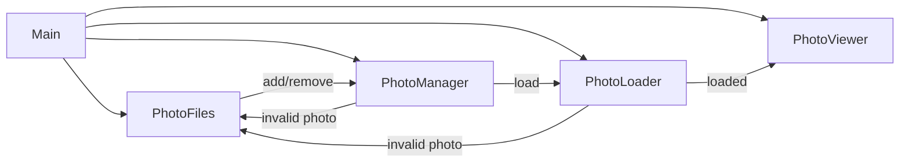

# Photoframe

A Rust-based digital photo frame application designed to run on a Raspberry Pi.

## Status

This project is **alpha and under development**

## Features (Tier 1)

- Recursive/scoped directory scanning (configurable)
- Image type filtering (jpg/png/gif/webp/bmp/tiff)
- Circular buffer (infinite loop)
- Fixed per-image delay (configurable)
- Error handling and structured logging

## Event Flow

## License

This project is licensed under the **MIT License**.
See the [LICENSE](LICENSE) file for full text.

### Third-Party Assets

This project may bundle fonts licensed under the SIL Open Font License (OFL) 1.1.

- Inconsolata (example font for UI text)
  - License: SIL OFL 1.1
  - License text: `assets/fonts/OFL.txt`
  - Notes: The font remains under OFL, which permits bundling with MIT-licensed code. If the font is modified, the Reserved Font Name rules apply.

© 2025 Vincent Lucarelli
