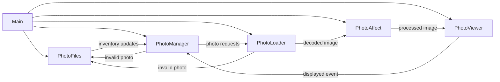

# Photo Frame

A digital photo frame driver implemented in Rust with a pipeline tuned for Raspberry Pi hardware. Watches a photo library, weights the playlist so new images appear more frequently, and renders each slide with configurable matting, transitions, and photo effects.

**Built for:** Raspberry Pi hobbyists, makers or photographers who want a bespoke display, and Rust developers interested in embedded graphics pipelines.

**Highlights:**

- Runs entirely on-device with a configurable playlist weighting system.
- Supports rich visual treatments (mats, transitions, print simulation) without requiring graphics expertise.

## Table of Contents

1. [Hardware](#hardware)
2. [Frame Setup](#frame-setup)
3. [Features](#features)
4. [Architecture Overview](#architecture-overview)
5. [Configuration](#configuration)
6. [Playlist Weighting](#playlist-weighting)
7. [Matting Configuration](#matting-configuration)
8. [References](#references)
9. [License](#license)

## Hardware

TODO - overview of hardware

- Raspberry Pi 5 with at least 4 GiB RAM
- 4K monitor
- Pi power plan
- HDMI cable
- SD card
- Mounting plan
- Frame

## Frame Setup

TODO - overview of setup

### Configure Pi

TODO - flash and scripts

### Build & Run

```bash
cargo run --release -- <path/to/config.yaml>
```

Use the core command above for day-to-day playback. Reach for the CLI flags below when you need to troubleshoot sequencing, create demo recordings, or confirm that configuration changes behave as expected.

| Flag                              | When to reach for it                                                                                                    |
| --------------------------------- | ----------------------------------------------------------------------------------------------------------------------- |
| `--playlist-now <RFC3339>`        | Freeze the virtual clock to reproduce playlist weights for debugging or long-form tests.                                |
| `--playlist-dry-run <ITERATIONS>` | Generate a textual preview of the weighted queue to check ordering before lighting up the display.                      |
| `--playlist-seed <SEED>`          | Lock the shuffle RNG so repeated runs (dry-run or live) produce the same ordering—handy for demos and regression tests. |

## Features

- Recursively scans a configurable photo library directory
  - Detects changes from external synchronization processes
    - Automatically adds new photos to the playlist
    - Removes deleted photos from the playlist
  - Prioritizes newer photos with user-configurable display rates
- Configurable matting, transitions, and photo effects
- Supports multiple image formats: JPG, PNG, GIF, WebP, BMP, TIFF
- Robust error handling with structured logging

## Architecture Overview

Curious how the frame stays responsive? This optional deep dive outlines the async tasks and their communication patterns. Skip ahead to [Configuration](#configuration) if you just want to tune the experience.

The runtime is composed of five asynchronous tasks orchestrated by `main.rs`. They communicate over bounded channels to keep memory predictable and to respect GPU/CPU parallelism limits.



## Configuration

The repository ships with a [sample `config.yaml`](./config.yaml) you can copy or edit directly. Place a YAML file alongside the binary (or somewhere readable) and pass its path as the CLI argument.

### Starter configuration

The example below targets a Pi driving a 4K portrait display backed by a NAS-mounted photo library. Inline comments explain why each value matters and what to tweak for common scenarios:

```yaml
photo-library-path: /path/to/photos

# Render/transition settings
transition:
  types: [fade] # List one entry for a fixed transition or multiple to randomize
  duration-ms: 400 # Duration for the selected transition
dwell-ms: 2000 # Time an image remains fully visible (ms)
viewer-preload-count: 3 # Images the viewer preloads; also sets viewer channel capacity
loader-max-concurrent-decodes: 4 # Concurrent decodes in the loader
oversample: 1.0 # GPU render oversample vs. screen size
startup-shuffle-seed: null # Optional deterministic seed for initial shuffle

photo-affect:
  types: [print-simulation] # Set to [] to disable all affects
  options:
    print-simulation:
      relief-strength: 0.35
      sheen-strength: 0.22

playlist:
  new-multiplicity: 3 # How many copies of a brand-new photo to schedule per cycle
  half-life: 3 days # How quickly that multiplicity decays back toward 1

matting:
  types: [fixed-color, blur] # Single entry = fixed mat, multiple entries = random rotation
  options:
    fixed-color:
      minimum-mat-percentage: 0.0 # % of each screen edge reserved for the mat border
      max-upscale-factor: 1.0 # Limit for enlarging images when applying mats
      color: [0, 0, 0]
    blur:
      minimum-mat-percentage: 4.0
      sigma: 18.0
```

If the frame launches to a black screen, double-check that `photo-library-path` points to a directory the runtime can read and that the user account has permission to access mounted network shares. You can validate a YAML edit quickly with `cargo run -- --playlist-dry-run 1`, which parses the config without opening the render window.

### Top-level keys

| Role                   | Keys                                                                  |
| ---------------------- | --------------------------------------------------------------------- |
| **Required**           | `photo-library-path`                                                  |
| **Core timing**        | `transition`, `dwell-ms`, `playlist`                                  |
| **Performance tuning** | `viewer-preload-count`, `loader-max-concurrent-decodes`, `oversample` |
| **Deterministic runs** | `startup-shuffle-seed`                                                |
| **Presentation**       | `photo-affect`, `matting`                                             |
| **Greeting Screen**    | `greeting-screen`                                                     |

Use the quick reference above to locate the knobs you care about, then dive into the per-key cards below for the details.

## rust-photo-frame-services

The provisioning toolchain under `setup/` installs three long-running services that keep the frame online and the library fresh. Run the existing system bootstrap (`setup/system-setup.sh`) and then execute `sudo ./setup/setup.sh` to apply these additional modules in order.

### Wi-Fi watcher and provisioning flow

- `wifi-watcher` is a Rust daemon that monitors `nmcli` connectivity every 30 s. When the network is online it writes `/run/photo-frame/wifi_up`, starts `photo-app.target`, and ensures the provisioning stack is idle. When connectivity drops it stops the slideshow, spins up a hotspot via `wifi-hotspot@wlan0.service`, launches the captive portal (`wifi-setter.service`), and displays a full-screen QR-code UI so someone nearby can reconfigure credentials.【F:setup/files/systemd/wifi-watcher.service†L1-L16】【F:setup/files/systemd/wifi-hotspot@.service†L1-L15】
- The watcher generates three-word hotspot passwords from `/opt/photo-frame/share/wordlist.txt` and writes them to `/run/photo-frame/hotspot.env` for the templated hotspot unit. Passwords appear verbatim in the on-device UI and in no logs.【F:setup/files/wordlist.txt†L1-L1024】【F:crates/wifi-watcher/src/hotspot.rs†L14-L120】
- `wifi-setter` is a minimal Axum web app bound to `0.0.0.0:80`. It scans for nearby SSIDs, differentiates between known and new connections, and updates NetworkManager in-place without duplicating profiles. Its `/api/status` endpoint lets the captive page auto-refresh once the Pi is back online.【F:crates/wifi-setter/src/web.rs†L1-L159】
- Both binaries honor configuration from `/etc/photo-frame/config.yaml` when present and fall back to the environment variables exposed in their systemd units: `WIFI_IFNAME` (default `wlan0`), `FRAME_USER` (default `frame`), `HOTSPOT_IP` (default `192.168.4.1`). Override them with `systemctl edit` drop-ins if your hardware differs.【F:setup/files/systemd/wifi-watcher.service†L8-L15】【F:setup/files/systemd/wifi-setter.service†L7-L14】
- Use `/opt/photo-frame/bin/print-status.sh` to inspect the current connectivity, hotspot state, slideshow target, and sync schedule in one place.【F:setup/files/bin/print-status.sh†L1-L43】

### Photo app orchestration

- `photo-app.target` gates startup of the slideshow, allowing the watcher to start and stop the renderer as Wi-Fi comes and goes. The unit keeps the process under the `frame` user, runs from `/opt/photo-frame`, and uses the existing `config.yaml` path. Do **not** enable `photo-app.service` directly; the watcher will start the target when connectivity is healthy.【F:setup/files/systemd/photo-app.service†L1-L16】【F:setup/modules/40-photo-app.sh†L16-L26】
- Optional kiosk tweaks—such as autologin to the `frame` user or hiding the cursor—can be layered on later using Raspberry Pi OS’ standard GUI settings. They are documented but intentionally not enforced by these modules.

### Cloud photo sync

- `sync-photos.service` is a oneshot wrapper around `rclone sync`, mirroring the configured remote directly into the live `photo-library-path`. It relies on rclone’s temp-file writes and atomic renames, so the viewer never sees partially copied images.【F:setup/files/systemd/sync-photos.service†L1-L28】
- The paired timer defaults to `OnCalendar=hourly`; override the cadence by editing `/etc/systemd/system/sync-photos.timer.d/override.conf` where the setup module writes the initial schedule. Set `RCLONE_REMOTE` (for cloud endpoints) or switch to `SYNC_TOOL=rsync` with `RSYNC_SOURCE` when pulling from another host.【F:setup/modules/50-sync.sh†L37-L66】
- Required paths come from `config.yaml` when present; if the YAML omits `photo-library-path`, the setup script writes `PHOTO_LIBRARY_PATH` into a drop-in so the service still knows where to sync.【F:setup/modules/50-sync.sh†L20-L66】

### Quickstart

1. Run the normal bootstrap (`setup/system-setup.sh`) to provision base dependencies, then execute `sudo ./setup/setup.sh` to install the watcher, hotspot, photo-app target, and sync timer.
2. Configure a cloud remote with `rclone config`, then set `RCLONE_REMOTE` (and optional `RCLONE_FLAGS`) via `systemctl edit sync-photos.service`.
3. Reboot or start `wifi-watcher.service`. If Wi-Fi is unavailable, connect to the “Frame-Setup” hotspot, scan the QR code, and submit new credentials through the captive portal.
4. Once online, the photo app launches automatically and `sync-photos.timer` keeps the library mirrored on the cadence defined by `SYNC_SCHEDULE` (default hourly).

#### `photo-library-path`

- **Purpose:** Sets the root directory that will be scanned recursively for supported photo formats.
- **Required?** Yes. Leave it unset and the application has no images to display.
- **Accepted values & defaults:** Any absolute or relative filesystem path. There is no usable default.
- **Effect on behavior:** Switching the path changes the library the watcher monitors; the viewer reloads the playlist when the directory contents change.

#### `transition`

- **Purpose:** Controls how the viewer blends between photos.
- **Required?** Optional; when omitted the frame uses a 400 ms fade.
- **Accepted values & defaults:** Provide a mapping with the keys documented in [Transition configuration](#transition-configuration). Defaults to `types: [fade]` with the standard fade options.
- **Effect on behavior:** Adjust the duration, direction, randomness, or transition family to match the feel you want—from subtle fades to bold pushes or e‑ink style reveals.

#### `dwell-ms`

- **Purpose:** Defines how long the current photo remains fully visible before a transition kicks in.
- **Required?** Optional.
- **Accepted values & defaults:** Positive integer in milliseconds; default `2000`. Validation rejects zero or negative values.
- **Effect on behavior:** Raising the value slows the slideshow; lowering it speeds up how quickly the frame advances.

#### `viewer-preload-count`

- **Purpose:** Sets the number of decoded images the viewer keeps queued ahead of the slide currently on screen.
- **Required?** Optional.
- **Accepted values & defaults:** Positive integer; default `3`. Validation ensures the count stays above zero.
- **Effect on behavior:** Higher counts buffer more content, smoothing playback on slower storage but increasing GPU memory usage; lower counts conserve memory at the risk of showing load hitches.

#### `loader-max-concurrent-decodes`

- **Purpose:** Limits how many images the CPU decoding task processes simultaneously.
- **Required?** Optional.
- **Accepted values & defaults:** Positive integer; default `4`. Validation enforces a minimum of one.
- **Effect on behavior:** Increasing the cap can keep the pipeline fed on multi-core systems; decreasing it prevents lower-powered CPUs from thrashing under heavy decode loads.

#### `oversample`

- **Purpose:** Adjusts the off-screen render resolution relative to the display.
- **Required?** Optional.
- **Accepted values & defaults:** Positive floating-point value; default `1.0`. Validation requires values above zero.
- **Effect on behavior:** Values slightly above `1.0` sharpen edges and reduce aliasing; values near `1.0` minimize GPU work. Sub-unit values are rejected to avoid undersampling artifacts.

#### `startup-shuffle-seed`

- **Purpose:** Seeds the initial RNG used when shuffling the first playlist.
- **Required?** Optional.
- **Accepted values & defaults:** Unsigned 64-bit integer or `null`; default `null`. When omitted the shuffle derives entropy from the system RNG.
- **Effect on behavior:** Providing a seed freezes the opening playlist order, which is helpful for demos, debugging, or deterministic tests. Leaving it `null` keeps the slideshow fresh on every boot.

#### `playlist`

- **Purpose:** Tunes how the weighting system surfaces new photos.
- **Required?** Optional.
- **Accepted values & defaults:** Mapping described in [Playlist weighting](#playlist-weighting); defaults to three copies for new images and a one-day half-life.
- **Effect on behavior:** Aggressive settings make new imports loop repeatedly until they age; conservative settings let the library settle into an even rotation.

#### `photo-affect`

- **Type:** mapping (see [Photo affect configuration](#photo-affect-configuration))
- **Default:** disabled (`types: []`)
- **What it does:** Inserts an optional post-processing stage between the loader and viewer. The built-in `print-simulation`
  affect relights each frame with directional shading and paper sheen inspired by _3D Simulation of Prints for Improved Soft Proofing_.
- **When to change it:** Enable when you want the frame to mimic how ink interacts with paper under gallery lighting, or when you
  add additional affects in future releases.

#### `greeting-screen`

- **Purpose:** Styles the GPU-rendered welcome card displayed while the library is still warming up.
- **Required?** Optional.
- **Accepted values & defaults:** Mapping with optional keys
  - `message` (string, default `Initializing…`),
  - `font` (string font name; falls back to the bundled face when missing),
  - `stroke-width` (float DIP, default `12.0`),
  - `corner-radius` (float DIP, default `0.75 × stroke-width`),
  - `duration-seconds` (float ≥ 0, default `4.0`),
  - `colors.background`, `colors.font`, `colors.accent` (hex sRGB strings; default palette keeps high contrast).
- **Effect on behavior:** The renderer fits and centers the configured message inside a rounded double-line frame. `duration-seconds`
  guarantees the greeting remains on screen for at least that many seconds before the first photo appears, even when decoding finishes instantly.
- **Notes:** Colors accept `#rgb`, `#rgba`, `#rrggbb`, or `#rrggbbaa` notation. Low-contrast combinations log a warning so you can tweak
  readability, and the viewer continues with sensible defaults if fonts or colors are omitted.

#### `matting`

- **Purpose:** Chooses the mat/background style rendered behind every photo.
- **Required?** Optional.
- **Accepted values & defaults:** Mapping described in [Matting configuration](#matting-configuration); defaults to a black fixed-color mat.
- **Effect on behavior:** Selecting different mat types changes the visual framing—from gallery-style solids to soft blurs or custom imagery.

### Playlist weighting

The playlist treats every photo as a node in a cycle. Brand-new photos are temporarily duplicated so that they appear multiple times per cycle, then decay back toward a single appearance as they age.

The multiplicity for each photo is computed as:

```
multiplicity(age) = ceil(max(1, new_multiplicity) * 0.5^(age / half_life))
```

Where `age` is the difference between the active playlist clock and the photo's creation timestamp. By default the clock is `SystemTime::now()`, but you can freeze it for testing with the `--playlist-now <RFC3339>` CLI flag. The `half-life` duration controls how quickly the multiplicity decays; once a photo's age reaches one half-life the multiplicity halves. Each cycle shuffles the scheduled copies so every photo appears at least once, and new arrivals are pinned to the front of the queue so their first showing happens immediately.

#### Testing the weighting

Use the new dry-run tooling to validate a configuration without launching the UI:

```bash
cargo run --release -- \
  config.yaml \
  --playlist-now 2025-01-01T00:00:00Z \
  --playlist-dry-run 32 \
  --playlist-seed 1234
```

The command prints the multiplicity assigned to each discovered photo and the first 32 scheduled entries according to the weighted queue. Run with `RUST_LOG=info` (or `debug` for per-photo weights) during a normal session to watch the manager log the same multiplicity calculations as the playlist rebuilds.

#### Playlist knobs

| Field              | Required? | Default | Accepted values                                                             | Effect on the slideshow                                                                                     |
| ------------------ | --------- | ------- | --------------------------------------------------------------------------- | ----------------------------------------------------------------------------------------------------------- |
| `new-multiplicity` | Optional  | `3`     | Integer ≥ 1                                                                 | Sets how many times a brand-new photo appears in the next loop; higher values surface newcomers more often. |
| `half-life`        | Optional  | `1 day` | Positive duration string parsed by [`humantime`](https://docs.rs/humantime) | Controls how quickly the extra repeats decay; shorter half-lives return the playlist to equilibrium faster. |

### Photo affect configuration

The optional `photo-affect` task sits between the loader and the viewer. When enabled it reconstructs the decoded RGBA pixels, applies any configured affects, and forwards the modified image downstream. Leave `types` empty (or omit the block entirely) to short-circuit the stage and pass photos through untouched.

#### Scheduling affects

- **`types`** — List the affect kinds to rotate through. Supported values today: `print-simulation`. Set to `[]` to keep the stage disabled while preserving the scaffold for future affects.
- **`type-selection`** — Optional. `random` (default) or `sequential`. `random` draws an affect independently for each slide, while `sequential` walks the `types` list in order and loops back to the first entry after the last.
- **`options`** — Map of per-affect controls. Every affect referenced in `types` must appear here so the runtime can look up its parameters.

Example: enable the print simulation affect while keeping its debug split active for quick before/after checks.

```yaml
photo-affect:
  types: [print-simulation]
  type-selection: sequential
  options:
    print-simulation:
      debug: true
```

#### Print-simulation affect

`print-simulation` adapts ideas from _3D Simulation of Prints for Improved Soft Proofing_ to mimic how a framed print interacts with gallery lighting. It derives a shallow height-field from local luminance gradients, shades that relief with a configurable key light, and layers in ink compression plus paper sheen so highlights glow like coated stock. Tunable controls let operators dial in their paper stock and lighting rig:

- `light-angle-degrees` (float, default `135.0`): Direction of the simulated gallery lighting in degrees clockwise from the positive X axis.
- `relief-strength` (float ≥ 0, default `0.35`): Scale factor applied to the derived height-field before shading.
- `ink-spread` (float ≥ 0, default `0.18`): Tone compression coefficient that emulates dye absorption.
- `sheen-strength` (float ≥ 0, default `0.22`): How strongly the simulated paper sheen is blended into highlights.
- `paper-color` (RGB array, default `[245, 244, 240]`): Base tint of the reflective sheen layer.
- `debug` (bool, default `false`): When `true`, only the left half of the image receives the affect so you can compare it against the untouched right half.

### Transition configuration

The `transition` block controls how the viewer blends between photos. List one or more transition kinds under `transition.types`. A single entry locks the viewer to that transition, while multiple entries tell the app to pick a new one for each slide. Every type mentioned in `transition.types` must have matching settings either inline (when only one type is listed) or within `transition.options`. Legacy configs that still use `transition.type` continue to work; `type: random` now randomizes across the entries in `transition.options`.

#### Structure

| Key              | Required?                                                       | Default                        | Accepted values                                                 | Effect                                                                                                                                                              |
| ---------------- | --------------------------------------------------------------- | ------------------------------ | --------------------------------------------------------------- | ------------------------------------------------------------------------------------------------------------------------------------------------------------------- |
| `types`          | Yes                                                             | `['fade']`                     | Array containing one or more of `fade`, `wipe`, `push`, `e-ink` | Determines which transition families are in play. Duplicates are ignored; at least one entry must be supplied.                                                      |
| `type-selection` | Optional (only valid when `types` has multiple entries)         | `random`                       | `random` or `sequential`                                        | Picks whether the app draws a new type randomly each slide or cycles through the list in order. Ignored when only one type is listed.                               |
| `options`        | Required when `types` has multiple entries (optional otherwise) | Defaults per transition family | Mapping keyed by transition kind                                | Provides per-type overrides for duration and mode-specific fields. When only one type is listed you can specify the same fields inline instead of creating the map. |

> **Note:** Reserve the word `random` for `type-selection`; adding it to `types` triggers a validation error.

Each transition option accepts the shared setting below:

- **`duration-ms`** (integer, default `400` for `fade`, `wipe`, `push`; `1600` for `e-ink`): Total runtime of the transition. Validation enforces values greater than zero; longer durations slow the hand-off between photos.

The remaining knobs depend on the transition family.

#### Example: wipe with a single angle

```yaml
transition:
  types: [wipe]
  duration-ms: 600
  angle-list-degrees: [120.0]
  softness: 0.12
```

When the list contains only one entry the viewer always uses that direction, so an explicit `angle-selection` strategy is unnecessary.

#### Example: randomized transition mix

```yaml
transition:
  types: [fade, wipe, push]
  type-selection: sequential
  options:
    fade:
      duration-ms: 500
    wipe:
      duration-ms: 600
      angle-list-degrees: [45.0, 225.0]
      angle-selection: sequential
      angle-jitter-degrees: 30.0
    push:
      duration-ms: 650
      angle-list-degrees: [0.0, 180.0]
```

Each transition exposes a focused set of fields:

- **`fade`**
  - **`through-black`** (boolean, default `false`): When `true`, fades to black completely before revealing the next image. Keeps cuts discreet at the cost of a slightly longer blackout.
- **`wipe`**
  - **`angle-list-degrees`** (array of floats, default `[0.0]`): Collection of wipe directions in degrees (`0°` sweeps left→right, `90°` sweeps top→bottom). At least one finite value is required.
  - **`angle-selection`** (`random` or `sequential`, default `random`): Governs how the app chooses from the angle list—either independently each slide or cycling in order.
  - **`angle-jitter-degrees`** (float ≥ 0, default `0.0`): Adds random jitter within ±the supplied degrees, preventing identical wipes.
  - **`softness`** (float, default `0.05`, clamped to `0.0–0.5`): Feathers the wipe edge; higher values create a softer blend.
- **`push`**
  - **`angle-list-degrees`** (array of floats, default `[0.0]`): Direction the new image pushes in from; the same rules as wipes apply.
  - **`angle-selection`** (`random` or `sequential`, default `random`): Selection strategy for the angle list.
  - **`angle-jitter-degrees`** (float ≥ 0, default `0.0`): Randomizes the push direction by ±the provided degrees.
- **`e-ink`**
  - **`flash-count`** (integer, default `3`, capped at `6`): Number of alternating black/flash-color pulses before the reveal.
  - **`reveal-portion`** (float, default `0.55`, clamped to `0.05–0.95`): Fraction of the timeline spent flashing before the stripes start uncovering the next slide.
  - **`stripe-count`** (integer ≥ 1, default `24`): How many horizontal bands sweep in; higher counts mimic a finer e-ink refresh.
  - **`flash-color`** (`[r, g, b]` array, default `[255, 255, 255]`): RGB color used for the bright flash phases before the black inversion. Channels outside `0–255` are clamped.

### Matting configuration

The `matting` table chooses how the background behind each photo is prepared. Each entry lives under `matting.options` and is keyed by the mat type (`fixed-color`, `blur`, `studio`, or `fixed-image`). Supply one or more entries in `matting.types`. A single entry locks the viewer to that mat, while multiple entries cause the app to pick a new mat for each slide. Every listed type must either be configured inline (when only one type is present) or provided inside `matting.options`. Older `matting.type` configurations are still accepted, and `type: random` rotates through the mats listed under `matting.options`.

#### Structure

| Key              | Required?                                                       | Default               | Accepted values                                                                | Effect                                                                                                                  |
| ---------------- | --------------------------------------------------------------- | --------------------- | ------------------------------------------------------------------------------ | ----------------------------------------------------------------------------------------------------------------------- |
| `types`          | Yes                                                             | `['fixed-color']`     | Array containing one or more of `fixed-color`, `blur`, `studio`, `fixed-image` | Chooses which mat styles are eligible. Duplicates are ignored; at least one entry must be supplied.                     |
| `type-selection` | Optional (only valid when `types` has multiple entries)         | `random`              | `random` or `sequential`                                                       | Switches between drawing mats randomly or cycling through them in order. Ignored when only one type is listed.          |
| `options`        | Required when `types` has multiple entries (optional otherwise) | Defaults per mat type | Mapping keyed by mat type                                                      | Provides per-style settings. When only one type is listed, you may set the same fields inline instead of using the map. |

> **Note:** Reserve the word `random` for `type-selection`; adding it to `types` triggers a validation error.

Every mat entry accepts the shared settings below:

- **`minimum-mat-percentage`** (float, default `0.0`): Fraction of each screen edge reserved for the mat border. The renderer clamps values to `0–45%` to maintain a visible photo area.
- **`max-upscale-factor`** (float, default `1.0`): Maximum enlargement applied to the photo when fitting inside the mat. Values below `1.0` are elevated to `1.0` to avoid shrinking detail; higher values allow the frame to gently zoom when extra border space is available.

A single studio mat:

```yaml
matting:
  types: [studio]
  options:
    studio:
      minimum-mat-percentage: 3.5
      bevel-width-px: 4.0
```

Random rotation between two mats:

```yaml
matting:
  types: [fixed-color, blur]
  options:
    fixed-color:
      minimum-mat-percentage: 0.0
      color: [0, 0, 0]
    blur:
      minimum-mat-percentage: 6.0
      sigma: 18.0
```

Every entry inside `matting.options` accepts the shared settings below:

- **map key** (string): Mat style to render. Use `fixed-color`, `blur`, `studio`, or `fixed-image`.

#### `fixed-color`

- **`color`** (`[r, g, b]` array, default `[0, 0, 0]`): RGB values (0–255) used to fill the mat background. Channels outside the range are clamped. Choose lighter colors to mimic gallery mats or darker tones for a cinematic look.

#### `blur`

- **`sigma`** (float, default `20.0`): Gaussian blur radius applied to a scaled copy of the photo that covers the screen. Larger values yield softer backgrounds; zero disables the blur but keeps the scaled image.
- **`max-sample-dimension`** (integer or `null`, default `null`; falls back to `2048` on 64-bit ARM, otherwise the canvas size): Optional cap on the intermediate blur resolution. Lower caps downsample before blurring, cutting CPU/GPU cost while preserving the dreamy backdrop.
- **`backend`** (`cpu` or `neon`, default `cpu`): Blur implementation to use. `neon` opts into the vector-accelerated path on 64-bit ARM; if unsupported at runtime the app gracefully falls back to the CPU renderer.

#### `studio`

- **`bevel-width-px`** (float, default `3.0`): Visible width of the bevel band in pixels. The renderer clamps the bevel if the mat border is thinner than the requested width.
- **`bevel-color`** (`[r, g, b]` array, default `[255, 255, 255]`): RGB values (0–255) used for the bevel band.
- **`texture-strength`** (float, default `1.0`): Strength of the simulated paper weave. `0.0` yields a flat matte; values above `1.0` exaggerate the texture.
- **`warp-period-px`** (float, default `5.6`): Horizontal spacing between vertical warp threads, in pixels.
- **`weft-period-px`** (float, default `5.2`): Vertical spacing between horizontal weft threads, in pixels.

The studio mat derives a uniform base color from the photo’s average RGB, renders a mitred bevel band with the configured width and color, blends a hint of the mat pigment along the outer lip, and shades the bevel from a fixed light direction so it reads as a cut paper core. The photo then sits flush against that inner frame.

#### `fixed-image`

- **`path`** (string, required): Filesystem path to the background image that should appear behind every photo. The file is loaded once at startup and cached for reuse.
- **`fit`** (`cover`, `contain`, or `stretch`; default `cover`): Chooses how the background scales to the canvas—fill while cropping (`cover`), letterbox without cropping (`contain`), or distort to fit exactly (`stretch`).

Selecting `fixed-image` keeps the backdrop perfectly consistent across slides, which is ideal for branded frames or themed installations.

## References

- **Procedural studio mat weave texture.** Our weave shading is adapted from Mike Cauchi’s breakdown of tillable cloth shading, which layers sine-profiled warp/weft threads with randomized grain to keep the pattern from banding. See ["Research – Tillable Images and Cloth Shading"](https://www.mikecauchiart.com/single-post/2017/01/23/research-tillable-images-and-cloth-shading).
- **Print simulation shading.** The gallery-lighting and relief model follows guidance from Rohit A. Patil, Mark D. Fairchild, and Garrett M. Johnson’s paper ["3D Simulation of Prints for Improved Soft Proofing"](https://doi.org/10.1117/12.813471).

## License

This project is licensed under the **MIT License**.
See the [LICENSE](LICENSE) file for full text.

### Third-Party Assets

This project may bundle fonts licensed under the SIL Open Font License (OFL) 1.1.

- Inconsolata (example font for UI text)
  - License: SIL OFL 1.1
  - License text: `assets/fonts/OFL.txt`
  - Notes: The font remains under OFL, which permits bundling with MIT-licensed code. If the font is modified, the Reserved Font Name rules apply.

© 2025 Vincent Lucarelli
