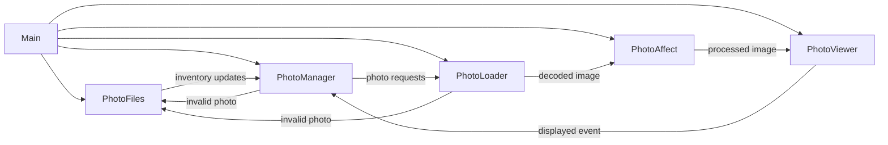

# Photo Frame

A digital photo frame driver implemented in Rust with a pipeline tuned for Raspberry Pi hardware. Watches a photo library, weights the playlist so new images appear more frequently, and renders each slide with configurable matting, transitions, and photo effects.

**Built for:** Raspberry Pi hobbyists, makers or photographers who want a bespoke display, and Rust developers interested in embedded graphics pipelines.

**Highlights:**

- Runs entirely on-device with a configurable playlist weighting system.
- Supports rich visual treatments (mats, transitions, print simulation) without requiring graphics expertise.
- External buttond integration handles wake/sleep scheduling and Wayland-friendly DPMS commands for HDMI displays.

## Table of Contents

1. [New to Photo Frame?](#new-to-photo-frame)
2. [Hardware](#hardware)
3. [Software Setup](#software-setup)
4. [Wi-Fi Recovery & Provisioning](#wi-fi-recovery--provisioning)
5. [Documentation Guide](#documentation-guide)
6. [Features](#features)
7. [Architecture Overview](#architecture-overview)
8. [Configuration](#configuration)
9. [Fabrication](#fabrication)
10. [References](#references)
11. [License](#license)

## New to Photo Frame?

Use this reading order for a first install:

1. Plan hardware: [docs/hardware.md](docs/hardware.md)
2. Provision and install software: [docs/software.md](docs/software.md)
3. Tune runtime behavior: [docs/configuration.md](docs/configuration.md)
4. Operate and troubleshoot: [docs/sop.md](docs/sop.md)

If you follow `docs/software.md` from top to bottom, you will finish with an installed kiosk session and a running slideshow.

## Hardware

Plan your build around a Raspberry Pi 5, a portrait-capable 4K monitor, and mounting hardware that hides cables while keeping airflow open. The dedicated hardware guide covers the recommended bill of materials plus optional accessories and planning tips. [Full details →](docs/hardware.md)

## Software Setup

From flashing Raspberry Pi OS to deploying the watcher, hotspot, and sync services, the setup guide walks through every command you need to bring the slideshow online. It also documents CLI flags for local debugging and a quickstart checklist for provisioning. [Full details →](docs/software.md)
Setup pipeline internals and helper-library notes are in [setup/README.md](setup/README.md).

> **Install layout at a glance**
>
> - `/opt/photo-frame` holds the read-only runtime artifacts that ship with the project: compiled binaries, unit files, and the pristine configuration templates staged by the setup scripts.
> - `/var/lib/photo-frame` carries the live state: logs, caches, hotspot artifacts, and any synchronized media. Treat this tree as the working area that systemd services mutate at runtime.
> - `/etc/photo-frame/config.yaml` holds the active configuration the services consume. Edit this copy (with `sudo`) to adjust library paths or button behavior.
>
> This split keeps upgrades simple—rerunning the installer refreshes `/opt` without clobbering the operator-managed data living under `/var`.

Looking for the Pi 5 kiosk recipe? The Trixie-specific instructions live in [docs/kiosk.md](docs/kiosk.md).

## Wi-Fi Recovery & Provisioning

When Wi-Fi drops, the frame pivots into a self-service recovery flow handled by the `wifi-manager` binary. It watches connectivity, launches a captive hotspot with a QR-code guided web UI, and writes fresh credentials back into NetworkManager—without ever running `cargo` as root.

- **Automatic hotspot:** offline detection after a configurable grace period launches the **PhotoFrame-Setup** access point secured with a random three-word passphrase.
- **Guided UI:** the on-device web server (default `http://192.168.4.1:8080/`) collects the replacement SSID/password and reports provisioning progress live.
- **Systemd integration:** `photoframe-wifi-manager.service` runs as the `kiosk` user, restarts on failure, and keeps operational breadcrumbs in `/var/lib/photo-frame` (hotspot password, QR image, last provisioning attempt).

Full operating procedures, configuration options, and troubleshooting steps are documented in [docs/wifi-manager.md](docs/wifi-manager.md).

## Documentation Guide

Use [docs/README.md](docs/README.md) for a role-based map (fresh install, day-2 ops, Wi-Fi internals, and developer validation).

## Repository Layout

- `crates/photo-frame`: primary slideshow application crate.
- `crates/buttond`: systemd-friendly hardware button daemon.
- `crates/wifi-manager`: captive portal and Wi-Fi recovery agent.
- `setup/`: provisioning scripts used during Pi imaging.
- `docs/`: operational and architecture guides.
- `tests/`: manual smoke and diagnostics scripts.

## Features

- Recursively scans a configurable photo library directory
  - Detects changes from external synchronization processes
    - Automatically adds new photos to the playlist
    - Removes deleted photos from the playlist
  - Prioritizes newer photos with user-configurable display rates
- Configurable matting, transitions, and photo effects
- Supports multiple image formats: JPG, PNG, GIF, WebP, BMP, TIFF
- Robust error handling with structured logging
- buttond automatically derives the active Wayland display socket at startup, waiting briefly for the compositor when needed so DPMS commands stay reliable
- Boots to the greeting screen and waits for external `set-state` commands before advancing, keeping scheduling logic in buttond.

## Architecture Overview

Curious how the frame stays responsive? This optional deep dive outlines the async tasks and their communication patterns. Skip ahead to [Configuration](#configuration) if you just want to tune the experience.

The runtime is composed of five asynchronous tasks orchestrated by `main.rs`. They communicate over bounded channels to keep memory predictable and to respect GPU/CPU parallelism limits.

## Configuration

All configuration options—from playlist weighting and greeting screens to transition tuning—are documented in depth, including starter YAML, per-key reference tables, and copy/paste recipes. [Reference →](docs/configuration.md)

> **Matting at a glance:** The viewer walks `matting.active` from top to bottom, expanding inline palettes (such as `colors` arrays) into a canonical list of presets. Random and sequential selection both operate on that expanded list, so weighting or rotation happens after the inline swatches unfold. See the [full matting documentation](docs/configuration.md#matting-configuration) for details and examples.

Need help wiring buttond's wake/sleep schedule to Raspberry Pi + Dell HDMI hardware? The dedicated power guide covers DPMS commands, troubleshooting, and verification steps. [Power & sleep details →](docs/power-and-sleep.md)

## Fabrication

Plan the physical build of the frame with dedicated fabrication guidance that covers laser cutting, 3D-printed brackets, cabinetry, and a final assembly checklist. [Full details →](maker/fabrication.md)

## Credits

See [docs/credits.md](docs/credits.md) for image attributions.

## References

- **Procedural studio mat weave texture.** Our weave shading is adapted from Mike Cauchi’s breakdown of tillable cloth shading, which layers sine-profiled warp/weft threads with randomized grain to keep the pattern from banding. See ["Research – Tillable Images and Cloth Shading"](https://www.mikecauchiart.com/single-post/2017/01/23/research-tillable-images-and-cloth-shading).
- **Print simulation shading.** The gallery-lighting and relief model follows guidance from Rohit A. Patil, Mark D. Fairchild, and Garrett M. Johnson’s paper ["3D Simulation of Prints for Improved Soft Proofing"](https://doi.org/10.1117/12.813471).
## AI Statement

This project was developed with significant assistance from OpenAI’s AI tools:

- **ChatGPT** was used for design discussions, debugging strategies, and drafting technical documentation.
- **Codex** (OpenAI’s software engineering agent framework) was used extensively for code generation and documentation.

## License

This project is licensed under the **MIT License**. See the [LICENSE](LICENSE) file for full text.

© 2025 Vincent Lucarelli
