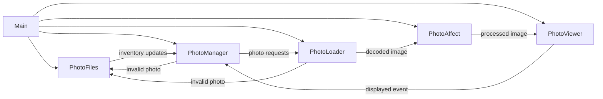

# Photoframe

A Rust-based digital photo frame pipeline tuned for Raspberry Pi hardware. It watches your photo library, weights the playlist so new images appear more frequently, and renders each slide with configurable matting and transitions.

## Project Status

This project is **alpha and under active development**. Expect rough edges and incomplete documentation.

## Table of Contents

1. [Quickstart](#quickstart)
2. [Architecture Overview](#architecture-overview)
3. [Features](#features)
4. [Configuration](#configuration)
5. [Playlist Weighting](#playlist-weighting)
6. [Photo Affect Configuration](#photo-affect-configuration)
7. [Matting Configuration](#matting-configuration)
8. [License](#license)

## Quickstart

### Prerequisites _(TODO: document Raspberry Pi OS version, GPU requirements, and external dependencies)_

### Build & Run

```bash
cargo run --release -- <path/to/config.yaml>
```

The binary accepts several optional CLI flags for playlist testing and determinism:

| Flag | Description |
| --- | --- |
| `--playlist-now <RFC3339>` | Overrides `SystemTime::now()` when computing playlist weights. Useful for reproducible simulations. |
| `--playlist-dry-run <ITERATIONS>` | Emits a textual preview of the weighted playlist order without launching the UI. |
| `--playlist-seed <SEED>` | Forces deterministic playlist shuffling for both dry-run and live modes. |

### Deployment _(TODO: outline systemd service, auto-start configuration, and graceful shutdown strategy)_

### Testing _(TODO: enumerate unit/integration test commands and GPU validation steps)_

## Architecture Overview

The runtime is composed of four asynchronous tasks orchestrated by `main.rs`. They communicate over bounded channels to keep memory predictable and to respect GPU/CPU parallelism limits.



## Features

### Tier 1 (implemented)

- Recursive/scoped directory scanning (configurable)
- Image type filtering (jpg/png/gif/webp/bmp/tiff)
- Circular buffer (infinite loop)
- Fixed per-image delay (configurable)
- Weighted playlist that repeats new photos using an exponential half-life decay
- Error handling and structured logging
- Optional photo-affect stage that can simulate print relief before rendering

### Tier 2+ _(TODO: summarize roadmap items from `Roadmap.md` and planned UX polish)_

## Configuration

Place a YAML file and pass its path as the CLI argument. Example:

```yaml
photo-library-path: /path/to/photos

# Render/transition settings
transition:
  types: [fade] # List one entry for a fixed transition or multiple to randomize
  duration-ms: 400 # Duration for the selected transition
dwell-ms: 2000 # Time an image remains fully visible (ms)
viewer-preload-count: 3 # Images the viewer preloads; also sets viewer channel capacity
loader-max-concurrent-decodes: 4 # Concurrent decodes in the loader
oversample: 1.0 # GPU render oversample vs. screen size
startup-shuffle-seed: null # Optional deterministic seed for initial shuffle

playlist:
  new-multiplicity: 3 # How many copies of a brand-new photo to schedule per cycle
  half-life: 3 days # How quickly that multiplicity decays back toward 1

matting:
  types: [fixed-color, blur] # Single entry = fixed mat, multiple entries = random rotation
  options:
    fixed-color:
      minimum-mat-percentage: 0.0 # % of each screen edge reserved for the mat border
      max-upscale-factor: 1.0 # Limit for enlarging images when applying mats
      color: [0, 0, 0]
    blur:
      minimum-mat-percentage: 4.0
      sigma: 18.0
```

### Top-level keys

| Role | Keys |
| --- | --- |
| **Required** | `photo-library-path`
| **Core timing** | `transition`, `dwell-ms`, `playlist`
| **Performance tuning** | `viewer-preload-count`, `loader-max-concurrent-decodes`, `oversample`
| **Deterministic runs** | `startup-shuffle-seed`
| **Presentation** | `matting`

Use the quick reference above to locate the knobs you care about, then dive into the per-key cards below for the details.

#### `photo-library-path`
- **Type:** string
- **Default:** `""`
- **What it does:** Defines the root directory that will be scanned recursively for photos.
- **When to change it:** Point it at the directory (or mounted network share) you want to display.

#### `transition`
- **Type:** mapping (see [Transition configuration](#transition-configuration))
- **What it does:** Controls how the viewer transitions between photos.
- **When to change it:** Use this to swap between fades, wipes, pushes, or a randomized mix.

#### `dwell-ms`
- **Type:** integer
- **Default:** `2000`
- **What it does:** Sets how long an image remains fully visible before the next transition starts.
- **When to change it:** Increase for a slower slideshow, decrease for a faster cadence.

#### `viewer-preload-count`
- **Type:** integer
- **Default:** `3`
- **What it does:** Number of prepared images the viewer keeps queued, which also controls GPU upload backlog.
- **When to change it:** Raise it if your storage is slow and you notice stutters; lower it on memory-constrained devices.

#### `loader-max-concurrent-decodes`
- **Type:** integer
- **Default:** `4`
- **What it does:** Caps how many CPU decodes can run in parallel.
- **When to change it:** Reduce on low-core systems to avoid contention, increase on powerful CPUs to keep the pipeline full.

#### `oversample`
- **Type:** float
- **Default:** `1.0`
- **What it does:** Sets the render target scale relative to the screen. Values >1.0 reduce aliasing at the cost of GPU time.
- **When to change it:** Bump it slightly for crisper transitions if your GPU has headroom.

#### `startup-shuffle-seed`
- **Type:** integer or `null`
- **Default:** `null`
- **What it does:** Optional deterministic seed used for the initial photo shuffle.
- **When to change it:** Provide a number when you want reproducible startup order for demos or testing.

#### `playlist`
- **Type:** mapping (see [Playlist weighting](#playlist-weighting))
- **What it does:** Controls how aggressively new photos repeat before settling into the long-term cadence.
- **When to change it:** Adjust to surface new arrivals more or less frequently.

#### `matting`
- **Type:** mapping (see [Matting configuration](#matting-configuration))
- **What it does:** Chooses how mats are generated around each photo.
- **When to change it:** Configure to match the look you want—solid mats, blurred backgrounds, or studio-style bevels.

### Playlist weighting

The playlist treats every photo as a node in a cycle. Brand-new photos are temporarily duplicated so that they appear multiple times per cycle, then decay back toward a single appearance as they age.

The multiplicity for each photo is computed as:

```
multiplicity(age) = ceil(max(1, new_multiplicity) * 0.5^(age / half_life))
```

Where `age` is the difference between the active playlist clock and the photo's creation timestamp. By default the clock is `SystemTime::now()`, but you can freeze it for testing with the `--playlist-now <RFC3339>` CLI flag. The `half-life` duration controls how quickly the multiplicity decays; once a photo's age reaches one half-life the multiplicity halves. Each cycle shuffles the scheduled copies so every photo appears at least once, and new arrivals are pinned to the front of the queue so their first showing happens immediately.

#### Testing the weighting

Use the new dry-run tooling to validate a configuration without launching the UI:

```bash
cargo run --release -- \
  config.yaml \
  --playlist-now 2025-01-01T00:00:00Z \
  --playlist-dry-run 32 \
  --playlist-seed 1234
```

The command prints the multiplicity assigned to each discovered photo and the first 32 scheduled entries according to the weighted queue. Run with `RUST_LOG=info` (or `debug` for per-photo weights) during a normal session to watch the manager log the same multiplicity calculations as the playlist rebuilds.

#### Playlist knobs

- **`new-multiplicity`** (integer, default `3`): Number of copies a brand-new photo receives in the next playlist cycle.
- **`half-life`** (duration string, default `1 day`): Exponential half-life governing how quickly the multiplicity decays toward `1`. Accepts human-friendly strings via [`humantime`](https://docs.rs/humantime).

### Transition configuration

The `transition` block controls how the viewer blends between photos. List one or more transition kinds under `transition.types`. A single entry locks the viewer to that transition, while multiple entries tell the app to pick randomly on each slide. Every type mentioned in `transition.types` must have matching settings either inline (when only one type is listed) or within `transition.options`. Legacy configs that still use `transition.type` continue to work; `type: random` now randomizes across whichever entries appear in `transition.options`.

#### Example: wipe with a single angle

```yaml
transition:
  types: [wipe]
  duration-ms: 600
  angle-list-degrees: [120.0]
  softness: 0.12
```

When the list contains only one entry the viewer always uses that direction, so an explicit `angle-selection` strategy is unnecessary.

#### Example: randomized transition mix

```yaml
transition:
  types: [fade, wipe, push]
  options:
    fade:
      duration-ms: 500
    wipe:
      duration-ms: 600
      angle-list-degrees: [45.0, 225.0]
      angle-selection: round-robin
      angle-jitter-degrees: 30.0
    push:
      duration-ms: 650
      angle-list-degrees: [0.0, 180.0]
```

<<<<<<< HEAD
Each transition exposes a focused set of fields:

- **`fade`**
  - `duration-ms`: Transition length in milliseconds.
  - `through-black`: Boolean toggle to fade to black before revealing the next image.
- **`wipe`**
  - `duration-ms`: Transition length in milliseconds.
  - `angle-list-degrees`: List of angles to use for direction of wipe.
  - `angle-selection`: Use `random` for independent draws or `round-robin` to cycle through the angles in order.
  - `angle-jitter-degrees`: Random +/- degrees per transition.
  - `softness`: Edge feather amount (0–0.5).
- **`push`**
  - `duration-ms`: Transition length in milliseconds.
  - `angle-list-degrees`: List of angles to use for direction of wipe.
  - `angle-selection`: Use `random` for independent draws or `round-robin` to cycle through the angles in order.
  - `angle-jitter-degrees`: Random +/- degrees per transition.
- **`e-ink`**
  - `duration-ms`: Transition length in milliseconds.
  - `flash-count`: Number of alternating black/flash-color pulses to run before the reveal (capped at 6).
  - `reveal-portion`: Fraction of the timeline (0.05–0.95) spent on the flashing prep before stripes begin revealing the next image.
  - `stripe-count`: How many horizontal bands sweep in to reveal the next photo; higher values mimic finer e-ink refresh passes.
  - `flash-color`: `[r, g, b]` color (0–255) used for the light flash phase before the black inversion.

### Photo affect configuration

The `photo-affects` block introduces an optional processing stage that sits between the loader and the viewer. When the `types`
list is empty the task is effectively a no-op pass-through. Populate `photo-affects.types` to opt into one or more effects and
use `photo-affects.type-selection` to decide how the stage rotates through them (mirroring the matting and transition semantics).

The first available effect, `print-3d`, draws on the lighting cues described in *3D Simulation of Prints for Improved Soft
Proofing* by Rohit A. Patil, Mark D. Fairchild, and Garrett M. Johnson. It computes a per-pixel surface normal from the photo’s
local luminance gradient, shades the image with a configurable light direction, and adds a subtle specular highlight to mimic the
depth cues you see when tilting a physical print.

Enable the affect by listing it under `photo-affects.types` and tuning its controls inside `photo-affects.options.print-3d`:

```yaml
photo-affects:
  types: [print-3d]
  type-selection: random
  options:
    print-3d:
      relief-strength: 1.6
      light-azimuth-degrees: 135.0
      light-elevation-degrees: 55.0
      ambient: 0.35
      diffuse: 0.65
      specular-strength: 0.25
      specular-shininess: 24.0
      shadow-floor: 0.15
      highlight-gain: 0.35
```

Key parameters:

- **`relief-strength`** (float, default `1.6`): Scales how strongly luminance gradients tilt the simulated surface normal. Lower
  values soften the relief; higher values deepen highlights and shadows.
- **`light-azimuth-degrees`** (float, default `135.0`): Compass direction (0° = positive X, 90° = positive Y) for the virtual
  key light.
- **`light-elevation-degrees`** (float, default `55.0`): Elevation angle for the light source above the print plane.
- **`ambient`** (float 0–1, default `0.35`): Base illumination floor to keep shadows from crushing.
- **`diffuse`** (float 0–1, default `0.65`): Diffuse contribution applied to the Lambertian term.
- **`specular-strength`** (float, default `0.25`): Amount of specular highlight energy added to the shading model.
- **`specular-shininess`** (float, default `24.0`): Controls the width of the specular highlight (larger = tighter highlights).
- **`shadow-floor`** (float 0–1, default `0.15`): Minimum multiplier applied to preserve detail in the darkest regions.
- **`highlight-gain`** (float, default `0.35`): Additional boost applied to specular highlights to mimic glossy paper sheen.

Future affects can reuse the same `types`/`type-selection` surface; each new affect simply registers a new key under
`photo-affects.options` with its own option set.

### Matting configuration

The `matting` table chooses how the background behind each photo is prepared. Each entry lives under `matting.options` and is keyed by the mat type (`fixed-color`, `blur`, `studio`, or `fixed-image`). Supply one or more entries in `matting.types`. A single entry locks the viewer to that mat, while multiple entries cause the app to pick randomly. Every listed type must either be configured inline (when only one type is present) or provided inside `matting.options`. Older `matting.type` configurations are still accepted, and `type: random` rotates through the mats listed under `matting.options`.

A single studio mat:

```yaml
matting:
  types: [studio]
  options:
    studio:
      minimum-mat-percentage: 3.5
      bevel-width-px: 4.0
```

Random rotation between two mats:

```yaml
matting:
  types: [fixed-color, blur]
  options:
    fixed-color:
      minimum-mat-percentage: 0.0
      color: [0, 0, 0]
    blur:
      minimum-mat-percentage: 6.0
      sigma: 18.0
```

Every entry inside `matting.options` accepts the shared settings below:

- **`minimum-mat-percentage`** (float, default `0.0`): Fraction (0–45%) of each screen edge reserved for the mat border.
- **`max-upscale-factor`** (float, default `1.0`): Maximum enlargement factor when fitting inside the mat; `1.0` disables upscaling.
- **map key** (string): Mat style to render. Use `fixed-color`, `blur`, `studio`, or `fixed-image`.

#### `fixed-color`

- **`color`** (`[r, g, b]` array, default `[0, 0, 0]`): RGB values (0–255) used to fill the mat background.

#### `blur`

- **`sigma`** (float, default `20.0`): Gaussian blur radius applied to a scaled copy of the photo that covers the screen.
- **`max-sample-dim`** (integer or `null`, default `null`; defaults to `2048` on 64-bit ARM builds, otherwise unlimited): Optional cap on the background texture size used for the blur. When set, the background is downscaled to this maximum dimension before blurring and then upscaled back to the screen size, preserving the soft-focus look while reducing CPU cost on small GPUs.
- **`backend`** (string, default `cpu`): Blur implementation to use. Set to `cpu` for the high-quality software renderer (default) or `neon` to request the vector-accelerated path on 64-bit ARM. When `neon` is selected but unsupported at runtime, the code automatically falls back to the CPU backend.

#### `studio`

- **`bevel-width-px`** (float, default `3.0`): Visible width of the bevel band in pixels. The renderer clamps this value to the available mat border if the photo touches an edge.
- **`bevel-color`** (`[r, g, b]` array, default `[255, 255, 255]`): RGB values (0–255) used for the bevel band.
- **`texture-strength`** (float, default `1.0`): Strength of the simulated paper texture (0.0 disables the effect, 1.0 keeps the default weave).
- **`warp-period-px`** (float, default `5.6`): Horizontal spacing between vertical warp threads in pixels.
- **`weft-period-px`** (float, default `5.2`): Vertical spacing between horizontal weft threads in pixels.

The studio mat derives a uniform base color from the photo’s average RGB, renders a mitred bevel band with the configured width and color, blends a hint of the mat pigment along the outer lip, and shades the bevel from a fixed light direction so it reads as a cut paper core. The photo then sits flush against that inner frame.

#### `fixed-image`

- **`path`** (string, required): Filesystem path to the background image that should appear behind every photo.
- **`fit`** (string, default `cover`): How the background image is scaled to the canvas. Options: `cover` (default, fills while cropping as needed), `contain` (letterboxes to preserve the whole image), or `stretch` (distorts to exactly fill).

The fixed background image is loaded once at startup and reused for every slide, ensuring smooth transitions even with large source files.

## References

- **Procedural studio mat weave texture.** Our weave shading is adapted from Mike Cauchi’s breakdown of tillable cloth shading, which layers sine-profiled warp/weft threads with randomized grain to keep the pattern from banding. See ["Research – Tillable Images and Cloth Shading"](https://www.mikecauchiart.com/single-post/2017/01/23/research-tillable-images-and-cloth-shading).

## License

This project is licensed under the **MIT License**.
See the [LICENSE](LICENSE) file for full text.

### Third-Party Assets

This project may bundle fonts licensed under the SIL Open Font License (OFL) 1.1.

- Inconsolata (example font for UI text)
  - License: SIL OFL 1.1
  - License text: `assets/fonts/OFL.txt`
  - Notes: The font remains under OFL, which permits bundling with MIT-licensed code. If the font is modified, the Reserved Font Name rules apply.

© 2025 Vincent Lucarelli
