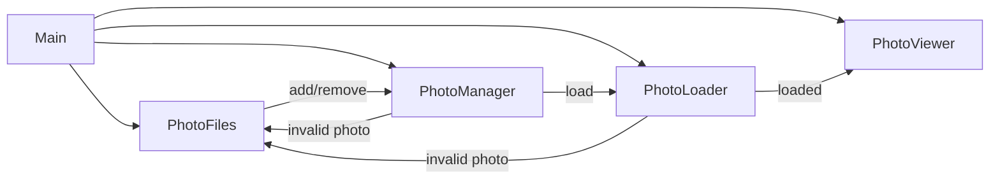

# Photoframe

A Rust-based digital photo frame application designed to run on a Raspberry Pi.

## Status

This project is **alpha and under development**

## Features (Tier 1)

- Recursive/scoped directory scanning (configurable)
- Image type filtering (jpg/png/gif/webp/bmp/tiff)
- Weighted circular playlist that boosts new photos then gracefully decays
- Fixed per-image delay (configurable)
- Error handling and structured logging

## Event Flow



## Configuration

Place a YAML file and pass its path as the CLI argument. Example:

```yaml
photo-library-path: /path/to/photos

# Render/transition settings
fade-ms: 400 # Cross-fade duration (ms)
dwell-ms: 2000 # Time an image remains fully visible (ms)
viewer-preload-count: 3 # Images the viewer preloads; also sets viewer channel capacity
loader-max-concurrent-decodes: 4 # Concurrent decodes in the loader
oversample: 1.0 # GPU render oversample vs. screen size
matting:
  mode: fixed-color # fixed-color|studio|blur|random
  color: [0, 0, 0]   # used for fixed-color mode
  minimum-border-percentage: 0.0  # percentage of shorter screen side reserved for mat border
```

Keys

- photo-library-path: Root directory for images to display.
- fade-ms: Cross-fade transition duration in milliseconds.
- dwell-ms: Dwell time before starting a transition, in milliseconds.
- viewer-preload-count: Number of images the viewer holds ready; determines backpressure depth to the loader.
- loader-max-concurrent-decodes: Max concurrent CPU decodes; tune for CPU/GPU balance.
- oversample: Scales render target up to reduce aliasing; 1.0 is native.
- matting.mode: Mat style (`fixed-color`, `studio`, `blur`, or `random`).
- matting.color: RGB array used when `mode` is `fixed-color`.
- matting.minimum-border-percentage: Minimum mat width as a percentage of the shorter screen dimension.

## License

This project is licensed under the **MIT License**.
See the [LICENSE](LICENSE) file for full text.

### Third-Party Assets

This project may bundle fonts licensed under the SIL Open Font License (OFL) 1.1.

- Inconsolata (example font for UI text)
  - License: SIL OFL 1.1
  - License text: `assets/fonts/OFL.txt`
  - Notes: The font remains under OFL, which permits bundling with MIT-licensed code. If the font is modified, the Reserved Font Name rules apply.

© 2025 Vincent Lucarelli
