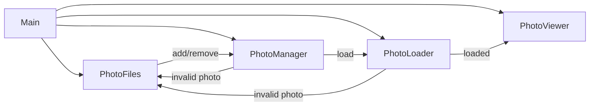
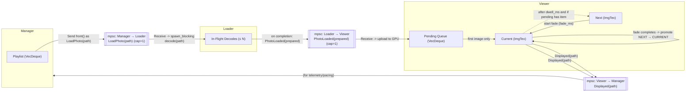

# Photoframe

A Rust-based digital photo frame application designed to run on a Raspberry Pi.

## Status

This project is **alpha and under development**

## Features (Tier 1)

- Recursive/scoped directory scanning (configurable)
- Image type filtering (jpg/png/gif/webp/bmp/tiff)
- Circular buffer (infinite loop)
- Fixed per-image delay (configurable)
- Error handling and structured logging

## Event Flow

## License

This project is licensed under the **MIT License**.
See the [LICENSE](LICENSE) file for full text.

### Third-Party Assets

This project may bundle fonts licensed under the SIL Open Font License (OFL) 1.1.

- Inconsolata (example font for UI text)
  - License: SIL OFL 1.1
  - License text: `assets/fonts/OFL.txt`
  - Notes: The font remains under OFL, which permits bundling with MIT-licensed code. If the font is modified, the Reserved Font Name rules apply.

© 2025 Vincent Lucarelli

## Image Lifecycle (Slideshow Pipeline)

The diagram below shows how a single image flows through the system from the front of the Manager playlist until it fades out on screen.

Key rules
- Manager pushes the front of the playlist to the Loader via `LoadPhoto(path)`. With a channel capacity >1, multiple futures can queue up.
- Loader decodes up to N images concurrently (blocking thread pool), then forwards `PhotoLoaded(prepared)` to the Viewer as each completes.
- Viewer uploads decoded images immediately and stores them in a small pending queue.
- Viewer shows the first image immediately (sets `displayed_at`) and only starts a crossfade to the next after `dwell_ms` has elapsed and a pending item is available.
- On fade completion, Viewer promotes `next → current` and emits `Displayed(path)`.

How can the same image show twice?
- Small playlist: If the playlist contains only a single path, Manager will keep sending the same path (by rotation) and Loader/Viewer will keep receiving identical images. The pending queue can then contain the same image multiple times, leading to back-to-back display of the same photo.
- Overproduction vs. consumption: Manager currently advances the playlist on successful send (channel write), not on `Displayed`. With a small playlist and a wider Manager→Loader channel, the same path can be re‑enqueued before the Viewer consumes previous arrivals. When the Viewer later drains pending at dwell boundaries, duplicates can surface consecutively.
- Timing bursts: Parallel decodes can complete in a burst for the same short playlist segment. If the pending queue is filled with duplicates before other unique images arrive, the next dwell cycles may still consume identical entries.

Next steps to eliminate duplicates without Viewer de‑duplication
- Use `Displayed` to pace Manager sends: send only when the Viewer signals completion, or track a bounded number of outstanding sends to avoid cycling the same path too quickly.
- Maintain a send cursor in Manager and skip re‑scheduling the same path if it’s already recently in flight.
- Optionally, widen the playlist (or shuffle on startup) to reduce the chance of immediate repeats when capacity is small.

About fade smoothness
- Fades are rendered on the GPU using alpha blending. For better perceptual smoothness: (a) use an eased alpha curve (e.g., smoothstep), and/or (b) blend in linear color space by rendering to a linear offscreen target and then presenting to the sRGB surface. These can be layered onto the existing pipeline for cleaner visuals.
