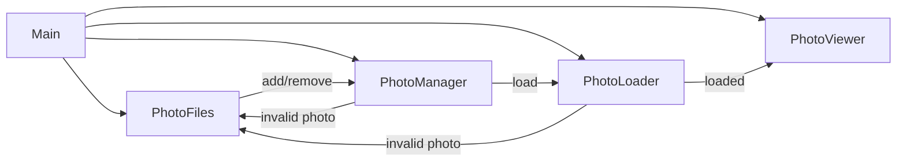

# Photoframe

A Rust-based digital photo frame application designed to run on a Raspberry Pi.

## Status

This project is **alpha and under development**

## Features (Tier 1)

- Recursive/scoped directory scanning (configurable)
- Image type filtering (jpg/png/gif/webp/bmp/tiff)
- Circular buffer (infinite loop)
- Fixed per-image delay (configurable)
- Weighted playlist that repeats new photos using an exponential half-life decay
- Error handling and structured logging

## Event Flow



## Configuration

Place a YAML file and pass its path as the CLI argument. Example:

```yaml
photo-library-path: /path/to/photos

# Render/transition settings
fade-ms: 400 # Cross-fade duration (ms)
dwell-ms: 2000 # Time an image remains fully visible (ms)
viewer-preload-count: 3 # Images the viewer preloads; also sets viewer channel capacity
loader-max-concurrent-decodes: 4 # Concurrent decodes in the loader
oversample: 1.0 # GPU render oversample vs. screen size
startup-shuffle-seed: null # Optional deterministic seed for initial shuffle

playlist:
  new-multiplicity: 3 # How many copies of a brand-new photo to schedule per cycle
  half-life: 3 days # How quickly that multiplicity decays back toward 1

matting:
  minimum-mat-percentage: 0.0 # % of each screen edge reserved for mat border
  max-upscale-factor: 1.0 # Limit for enlarging images when applying mats
  type: fixed-color
  color: [0, 0, 0]

button:
  enabled: true
  device-path: null
  key-code: KEY_POWER
  short-max-ms: 2000
  long-threshold-ms: 8000
  grab-device: true
  output-name: null
  use-wlr-randr: true
  use-vcgencmd-fallback: true
  shutdown-command: systemctl poweroff
```

### Top-level keys

| Key | Type | Default | Description |
| --- | --- | --- | --- |
| `photo-library-path` | string | `""` | Root directory that will be scanned recursively for photos. |
| `fade-ms` | integer | `400` | Cross-fade transition duration in milliseconds. |
| `dwell-ms` | integer | `2000` | Time an image remains fully visible before the next fade begins. |
| `viewer-preload-count` | integer | `3` | Number of prepared images the viewer keeps queued; controls GPU upload backlog. |
| `loader-max-concurrent-decodes` | integer | `4` | Maximum number of CPU decodes that can run in parallel. |
| `oversample` | float | `1.0` | Render target scale relative to the screen; values >1.0 reduce aliasing but cost GPU time. |
| `startup-shuffle-seed` | integer or `null` | `null` | Optional deterministic seed used for the initial photo shuffle. |
| `playlist` | mapping | see below | Controls how aggressively new photos repeat before settling into the long-term cadence. |
| `matting` | mapping | see below | Controls how mats are generated around each photo. |
| `button` | mapping | see below | Configures GPIO button handling, display control, and shutdown behavior. |

### Playlist weighting

The playlist treats every photo as a node in a cycle. Brand-new photos are temporarily duplicated so that they appear multiple times per cycle, then decay back toward a single appearance as they age.

The multiplicity for each photo is computed as:

```
multiplicity(age) = ceil(max(1, new_multiplicity) * 0.5^(age / half_life))
```

Where `age` is the difference between the active playlist clock and the photo's creation timestamp. By default the clock is `SystemTime::now()`, but you can freeze it for testing with the `--playlist-now <RFC3339>` CLI flag. The `half-life` duration controls how quickly the multiplicity decays; once a photo's age reaches one half-life the multiplicity halves. Each cycle shuffles the scheduled copies so every photo appears at least once, and new arrivals are pinned to the front of the queue so their first showing happens immediately.

#### Testing the weighting

Use the new dry-run tooling to validate a configuration without launching the UI:

```bash
cargo run --release -- \
  config.yaml \
  --playlist-now 2025-01-01T00:00:00Z \
  --playlist-dry-run 32 \
  --playlist-seed 1234
```

The command prints the multiplicity assigned to each discovered photo and the first 32 scheduled entries according to the weighted queue. Run with `RUST_LOG=info` (or `debug` for per-photo weights) during a normal session to watch the manager log the same multiplicity calculations as the playlist rebuilds.

| Key | Type | Default | Description |
| --- | --- | --- | --- |
| `new-multiplicity` | integer | `3` | Number of copies a brand-new photo receives in the next playlist cycle. |
| `half-life` | duration string | `1 day` | Exponential half-life governing how quickly the multiplicity decays toward `1`. Accepts human-friendly strings via [`humantime`](https://docs.rs/humantime). |

### Matting configuration

The `matting` table chooses how the background behind each photo is prepared.

| Key | Type | Default | Notes |
| --- | --- | --- | --- |
| `minimum-mat-percentage` | float | `0.0` | Fraction (0–45%) of each screen edge reserved for the mat border. |
| `max-upscale-factor` | float | `1.0` | Maximum enlargement factor when fitting inside the mat; `1.0` disables upscaling. |
| `type` | string | `fixed-color` | Mat style to render. The value selects one of the variants below. |

#### `type: fixed-color`

| Key | Type | Default | Description |
| --- | --- | --- | --- |
| `color` | `[r, g, b]` array | `[0, 0, 0]` | The RGB values (0–255) used to fill the mat background. |

#### `type: blur`

| Key | Type | Default | Description |
| --- | --- | --- | --- |
| `sigma` | float | `20.0` | Gaussian blur radius applied to a scaled copy of the photo that covers the screen. |
| `max-sample-dim` | integer or `null` | `null` (defaults to `2048` on 64-bit ARM builds, otherwise unlimited) | Optional cap on the background texture size used for the blur. When set, the background is downscaled to this maximum dimension before blurring and then upscaled back to the screen size, preserving the soft-focus look while reducing CPU cost on small GPUs. |
| `backend` | string | `cpu` | Blur implementation to use. Set to `cpu` for the high-quality software renderer (default) or `neon` to request the vector-accelerated path on 64-bit ARM. When `neon` is selected but unsupported at runtime, the code automatically falls back to the CPU backend. |

### GPIO button configuration

The `button` table configures the optional momentary button connected to GPIO3. By default the application listens for the `KEY_POWER` event produced by the kernel's `gpio-keys` device and classifies presses based on duration:

| Key | Type | Default | Description |
| --- | --- | --- | --- |
| `enabled` | boolean | `true` | Enables the asynchronous button task. Set to `false` to disable button handling entirely. |
| `device-path` | string or `null` | `null` | Optional explicit path to the input device (e.g. `/dev/input/event0`). When `null`, the task searches for a device whose name contains both "gpio" and "key". |
| `key-code` | string | `"KEY_POWER"` | Evdev key code to monitor. The default matches the code emitted by the `gpio-shutdown` overlay. |
| `short-max-ms` | integer | `2000` | Maximum press duration (in milliseconds) treated as a short press. Short presses toggle the display power state. |
| `long-threshold-ms` | integer | `8000` | Duration (ms) after which the button triggers an immediate shutdown, even if the key is still held. |
| `grab-device` | boolean | `true` | Attempt to grab the input device exclusively so other handlers do not react to the key. |
| `output-name` | string or `null` | `null` | Preferred Wayland output name. When `null`, the task auto-detects the first connected output reported by `wlr-randr`. |
| `use-wlr-randr` | boolean | `true` | Enable display control via `wlr-randr`. |
| `use-vcgencmd-fallback` | boolean | `true` | Allow falling back to `/usr/bin/vcgencmd display_power` when `wlr-randr` is unavailable or fails. |
| `shutdown-command` | string | `"systemctl poweroff"` | Command executed for long presses. It is invoked via `sh -c`, so shell features are available. |

Short presses (< `short-max-ms`) toggle the display state. Presses between the short and long thresholds fall in the "dead zone" and are ignored. When a press reaches the long threshold the configured shutdown command runs immediately; the eventual key release is drained from the event stream so the task stays in sync.

#### Raspberry Pi system setup

To integrate the GPIO button on Raspberry Pi OS (Bookworm) in a Wayland session, perform the following one-time system configuration steps as `root`:

1. Enable the [`gpio-shutdown`](https://www.raspberrypi.com/documentation/computers/config_txt.html#dtoverlay) overlay so the SoC wakes on GPIO3 and reports a debounced `KEY_POWER` event:

   ```ini
   # /boot/firmware/config.txt
   dtoverlay=gpio-shutdown,gpio=3,active_low=1,debounce=100
   ```

2. Prevent `systemd-logind` from handling the power key so the application can manage it:

   ```ini
   # /etc/systemd/logind.conf
   HandlePowerKey=ignore
   ```

   Then restart logind: `sudo systemctl restart systemd-logind`.

3. Install the display control tools:

   ```bash
   sudo apt update
   sudo apt install -y wlr-randr
   ```

   The app automatically falls back to `/usr/bin/vcgencmd display_power` when enabled.

4. Ensure the user that runs the photo frame belongs to the `input` group so it can read `/dev/input/event*` devices:

   ```bash
   sudo usermod -aG input $USER
   ```

   Log out and back in (or restart the service) after changing group membership.

## License

This project is licensed under the **MIT License**.
See the [LICENSE](LICENSE) file for full text.

### Third-Party Assets

This project may bundle fonts licensed under the SIL Open Font License (OFL) 1.1.

- Inconsolata (example font for UI text)
  - License: SIL OFL 1.1
  - License text: `assets/fonts/OFL.txt`
  - Notes: The font remains under OFL, which permits bundling with MIT-licensed code. If the font is modified, the Reserved Font Name rules apply.

© 2025 Vincent Lucarelli
