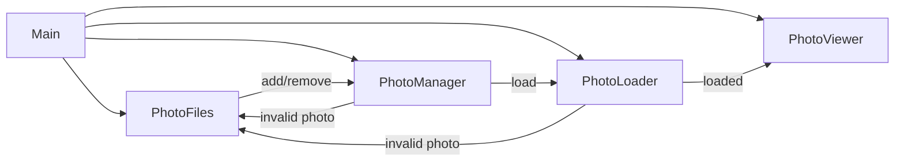

# Photoframe

A Rust-based digital photo frame application designed to run on a Raspberry Pi.

## Status

This project is **alpha and under development**

## Features (Tier 1)

- Recursive/scoped directory scanning (configurable)
- Image type filtering (jpg/png/gif/webp/bmp/tiff)
- Circular buffer (infinite loop)
- Fixed per-image delay (configurable)
- Error handling and structured logging

## Event Flow



## Configuration

Place a YAML file and pass its path as the CLI argument. Example:

```yaml
photo-library-path: /path/to/photos

# Render/transition settings
fade-ms: 400 # Cross-fade duration (ms)
dwell-ms: 2000 # Time an image remains fully visible (ms)
viewer-preload-count: 3 # Images the viewer preloads; also sets viewer channel capacity
loader-max-concurrent-decodes: 4 # Concurrent decodes in the loader
oversample: 1.0 # GPU render oversample vs. screen size
startup-shuffle-seed: null # Optional deterministic seed for initial shuffle

matting:
  minimum-mat-percentage: 0.0 # % of each screen edge reserved for mat border
  max-upscale-factor: 1.0 # Limit for enlarging images when applying mats
  type: fixed-color
  color: [0, 0, 0]
```

### Top-level keys

| Key | Type | Default | Description |
| --- | --- | --- | --- |
| `photo-library-path` | string | `""` | Root directory that will be scanned recursively for photos. |
| `fade-ms` | integer | `400` | Cross-fade transition duration in milliseconds. |
| `dwell-ms` | integer | `2000` | Time an image remains fully visible before the next fade begins. |
| `viewer-preload-count` | integer | `3` | Number of prepared images the viewer keeps queued; controls GPU upload backlog. |
| `loader-max-concurrent-decodes` | integer | `4` | Maximum number of CPU decodes that can run in parallel. |
| `oversample` | float | `1.0` | Render target scale relative to the screen; values >1.0 reduce aliasing but cost GPU time. |
| `startup-shuffle-seed` | integer or `null` | `null` | Optional deterministic seed used for the initial photo shuffle. |
| `matting` | mapping | see below | Controls how mats are generated around each photo. |

### Matting configuration

The `matting` table chooses how the background behind each photo is prepared.

| Key | Type | Default | Notes |
| --- | --- | --- | --- |
| `minimum-mat-percentage` | float | `0.0` | Fraction (0–45%) of each screen edge reserved for the mat border. |
| `max-upscale-factor` | float | `1.0` | Maximum enlargement factor when fitting inside the mat; `1.0` disables upscaling. |
| `type` | string | `fixed-color` | Mat style to render. The value selects one of the variants below. |

#### `type: fixed-color`

| Key | Type | Default | Description |
| --- | --- | --- | --- |
| `color` | `[r, g, b]` array | `[0, 0, 0]` | The RGB values (0–255) used to fill the mat background. |

#### `type: blur`

| Key | Type | Default | Description |
| --- | --- | --- | --- |
| `sigma` | float | `20.0` | Gaussian blur radius applied to a scaled copy of the photo that covers the screen. |
| `max-sample-dim` | integer or `null` | `null` (defaults to `2048` on 64-bit ARM builds, otherwise unlimited) | Optional cap on the background texture size used for the blur. When set, the background is downscaled to this maximum dimension before blurring and then upscaled back to the screen size, preserving the soft-focus look while reducing CPU cost on small GPUs. |
| `backend` | string | `cpu` | Blur implementation to use. Set to `cpu` for the high-quality software renderer (default) or `neon` to request the vector-accelerated path on 64-bit ARM. When `neon` is selected but unsupported at runtime, the code automatically falls back to the CPU backend. |

#### `type: studio`

| Key | Type | Default | Description |
| --- | --- | --- | --- |
| `bevel-width-px` | float | `3.0` | Visible width of the bevel band in pixels. The renderer clamps this value to the available mat border if the photo touches an edge. |
| `bevel-color` | `[r, g, b]` array | `[255, 255, 255]` | RGB values (0–255) used for the bevel band. |

The studio mat derives a uniform base color from the photo’s average RGB, renders a crisp mitred bevel band with the configured width and color, and reveals the photo flush against that inner frame.

#### `type: fixed-image`

| Key | Type | Default | Description |
| --- | --- | --- | --- |
| `path` | string | (required) | Filesystem path to the background image that should appear behind every photo. |
| `fit` | string | `cover` | How the background image is scaled to the canvas. Options: `cover` (default, fills while cropping as needed), `contain` (letterboxes to preserve the whole image), or `stretch` (distorts to exactly fill). |

The fixed background image is loaded once at startup and reused for every slide, ensuring smooth transitions even with large source files.

## License

This project is licensed under the **MIT License**.
See the [LICENSE](LICENSE) file for full text.

### Third-Party Assets

This project may bundle fonts licensed under the SIL Open Font License (OFL) 1.1.

- Inconsolata (example font for UI text)
  - License: SIL OFL 1.1
  - License text: `assets/fonts/OFL.txt`
  - Notes: The font remains under OFL, which permits bundling with MIT-licensed code. If the font is modified, the Reserved Font Name rules apply.

© 2025 Vincent Lucarelli
