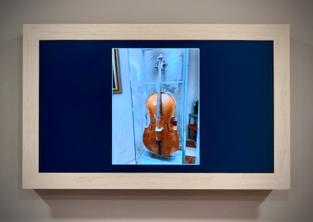
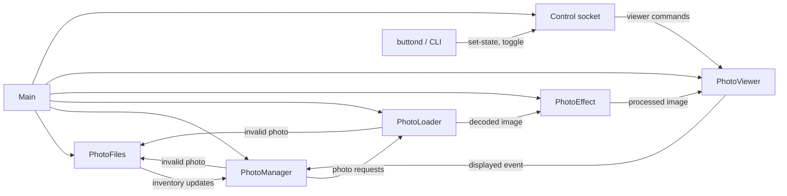

# Photo Frame



Build a wall-mounted digital photo frame from a Raspberry Pi 5 and a 4K monitor. It runs a self-managing slideshow from a local photo library: GPU-accelerated transitions, customizable matting, a smart playlist that surfaces newer photos first, and a built-in Wi-Fi recovery portal — all on-device, no cloud dependency after setup.

**Built for makers and hobbyists** who want a bespoke display they fully control, not a subscription appliance.

---

## What you'll build

A kiosk-mode Raspberry Pi 5 that:

- Cycles through photos in `/var/lib/photoframe/photos` with smooth GPU transitions and matting
- Wakes and sleeps on a configurable schedule (or stays on always — your choice)
- Recovers from Wi-Fi drops by raising a hotspot with a QR-code-guided web UI for re-provisioning credentials
- Accepts control commands over a Unix socket for scripting and hardware button integration

---

## What you'll need

| Component               | Notes                                                                                       |
| ----------------------- | ------------------------------------------------------------------------------------------- |
| Raspberry Pi 5 (4 GiB+) | 8 GiB recommended for 4K with effects                                                       |
| 4K monitor              | Tested with Dell S2725QC 27" 4K. HDMI-CEC is not used.                                      |
| Power                   | Pi 5 runs off the monitor's USB-C PD port; a 27W USB-C supply only if your monitor lacks PD |
| HDMI cable              | Short, high-quality run; the display won't tolerate a marginal cable                        |
| High-endurance microSD  | 32 GiB+ recommended for always-on use                                                       |
| Momentary pushbutton    | Optional — wires to Pi 5 power pads for hardware wake/sleep                                 |
| Mounting + enclosure    | French-cleat + shadow-box reference build with CAD files in `maker/`                        |

Full BOM and physical assembly: **[docs/build.md](docs/build.md)**.

---

## Get started

1. **Build the frame** — [docs/build.md](docs/build.md): BOM, button wiring, fabrication
2. **Install the software** — [docs/install.md](docs/install.md): SD card → first wake
3. **Preview effects** — a labeled tour of every transition and mat so you can choose which to configure: stage photos, run `showcase/activate.sh` on the Pi (see [showcase/README.md](showcase/README.md))
4. **Tune the experience** — [docs/configure.md](docs/configure.md): transitions, mats, schedule
5. **Run it day-to-day** — [docs/operate.md](docs/operate.md): commands and troubleshooting

Optional deeper dives (cloud sync, Wi-Fi internals, power model, memory tuning, kiosk stack) live in **[docs/advanced.md](docs/advanced.md)**.

If you want to modify the code, see **[CONTRIBUTING.md](CONTRIBUTING.md)** and the contributor guides under **[developer/](developer/)**.

---

## Transitions & mats

The frame ships eight GPU **transitions** (how one photo gives way to the next) and nine **mats** (the border/background framing each photo).

| Transitions       |                                                      |
| ----------------- | ---------------------------------------------------- |
| `fade`            | cross-fade (optionally through black)                |
| `wipe`            | directional linear wipe with a feathered edge        |
| `push`            | incoming photo slides in, pushing the old one out    |
| `e-ink`           | e-paper-style flash + stripe reveal                  |
| `dissolve`        | film-style value-noise threshold dissolve            |
| `radial-wipe`     | circle or diamond reveal growing from a center point |
| `venetian-blinds` | horizontal/vertical slat reveal                      |
| `crossfade-zoom`  | cross-fade with a gentle Ken-Burns zoom              |

| Mats             |                                                                |
| ---------------- | -------------------------------------------------------------- |
| `fixed-color`    | solid color border (one or more swatches)                      |
| `blur`           | blurred copy of the photo as the backdrop                      |
| `studio`         | museum mat board with a 45° bevel and linen-weave texture      |
| `fixed-image`    | your own image as the backdrop                                 |
| `gradient`       | linear or radial gradient between two colors                   |
| `vignette`       | solid color with darkened edges                                |
| `cinematic-blur` | blurred backdrop with darken + vignette (Apple-TV-aerial look) |
| `passe-partout`  | clean 45° bevel mat board, no weave (a crisper `studio`)       |
| `drop-shadow`    | photo floated above a solid mat with a soft drop shadow        |

Preview them live with the [showcase](showcase/README.md) tour. For commented examples of every option see [`config.yaml`](config.yaml); for the complete reference (every key, default, and behavior) see the Transition and Matting sections of [docs/configure.md](docs/configure.md).

---

## Repository layout

```
crates/photoframe/     Main slideshow application (GPU rendering, viewer pipeline)
crates/buttond/        Hardware button daemon + wake/sleep scheduling
crates/wifi-manager/   Captive portal and Wi-Fi recovery agent
crates/config-model/   Shared configuration types
setup/                 Provisioning scripts for Raspberry Pi OS
docs/                  build, install, configure, operate, advanced
showcase/              showcase.yaml, activate/deactivate scripts — labeled tour of every effect
maker/                 Physical build files (STL, SVG, SCAD)
developer/             Contributor guides (testing, architecture) + debug scripts
tests/                 Manual smoke tests and diagnostics scripts
config.yaml            Annotated example configuration
```

---

## How it works (optional deep dive)

The runtime is five async pipeline tasks — plus a Unix control-socket task — communicating over bounded channels. This keeps memory predictable and decouples CPU decode from GPU rendering.


```mermaid
flowchart LR
  MAIN[Main] --> FILES[PhotoFiles]
  MAIN --> MAN[PhotoManager]
  MAIN --> LOAD[PhotoLoader]
  MAIN --> AFFECT[PhotoEffect]
  MAIN --> VIEW[PhotoViewer]
  MAIN --> CTRL[Control socket]

  FILES -->|inventory updates| MAN
  MAN -->|invalid photo| FILES
  MAN -->|photo requests| LOAD
  LOAD -->|decoded image| AFFECT
  AFFECT -->|processed image| VIEW
  LOAD -->|invalid photo| FILES
  VIEW -->|displayed event| MAN

  BUTTOND[buttond / CLI] -->|set-state, toggle| CTRL
  CTRL -->|viewer commands| VIEW
```

- **PhotoFiles** — watches the library and maintains an inventory of available images
- **PhotoManager** — schedules photos on a virtual timeline; new photos appear more often and decay toward equal weight over a configurable half-life, with each photo spaced apart so repeats and bursts are avoided
- **PhotoLoader** — decodes JPEG/PNG in parallel (configurable concurrency) to RGBA pixel buffers
- **PhotoEffect** — optionally applies print-simulation effects (paper texture, gallery lighting)
- **PhotoViewer** — GPU-accelerated rendering with configurable matting and transitions via WGPU/Wayland
- **Control socket** (Unix) — accepts `set-state` / `toggle-state` commands from `buttond` (hardware button and wake/sleep schedule) or the CLI, and forwards them to the viewer

---

## References

- **Studio mat weave texture.** Adapted from Mike Cauchi's breakdown of tillable cloth shading. ["Research – Tillable Images and Cloth Shading"](https://www.mikecauchiart.com/single-post/2017/01/23/research-tillable-images-and-cloth-shading).
- **Print simulation shading.** Based on Rohit A. Patil, Mark D. Fairchild, and Garrett M. Johnson, ["3D Simulation of Prints for Improved Soft Proofing"](https://repository.rit.edu/cgi/viewcontent.cgi?article=1159&context=other).

---

## AI Statement

This project was developed with significant assistance from multiple AI tools:

- **Anthropic**: Claude Code with Sonnet & Opus models was used for design discussions, code generation, debugging, and drafting documentation.
- **OpenAI**: Codex with various GPT models was used for design discussions, code generation, debugging, and drafting documentation.

---

## License

MIT License — see [LICENSE](LICENSE) for full text.

© 2026 Vincent Lucarelli
