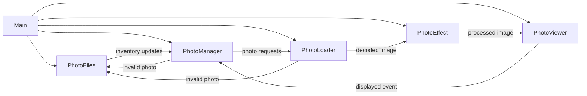

# Photo Frame

Build a wall-mounted digital photo frame using a Raspberry Pi 5 and a 4K monitor. It displays a self-managing slideshow from a local photo library: GPU-accelerated transitions, customizable matting styles, a smart playlist that surfaces newer photos first, and a built-in Wi-Fi recovery portal — all running on-device with no cloud dependency after setup.

**Built for makers and hobbyists** who want a bespoke display they fully control, not a subscription-based appliance.

---

## What you'll build

A kiosk-mode Raspberry Pi 5 that:
- Cycles through photos in `/var/lib/photoframe/photos` with smooth GPU transitions and matting
- Wakes and sleeps on a configurable schedule (or stays on all the time — your choice)
- Recovers from Wi-Fi drops by launching a hotspot with a QR-code guided web UI for re-provisioning credentials
- Accepts control commands over a Unix socket for scripting and hardware button integration

---

## What you'll need

| Component | Notes |
| --- | --- |
| Raspberry Pi 5 (4 GiB+) | The GPU headroom matters; 8 GiB recommended for 4K with effects |
| 4K monitor | Tested with Dell S2725QC 27" 4K. HDMI-CEC is not used. |
| USB-C power supply | Pi 5 needs a 27W USB-C PD supply (official Pi 5 adapter or equivalent) |
| HDMI cable | Short, high-quality run; the display won't tolerate a marginal cable |
| High-endurance microSD | 32 GiB+ recommended for always-on use |
| Momentary pushbutton | Optional — wires to Pi 5 power pads for hardware wake/sleep; see [hardware guide](docs/hardware.md) |
| Mounting + enclosure | See [fabrication guide](maker/fabrication.md) for a tested French-cleat + shadow-box build |

[Full hardware guide →](docs/hardware.md)

---

## Get started

1. **Plan your hardware** — [docs/hardware.md](docs/hardware.md)
2. **Install the software** — [docs/installation.md](docs/installation.md)
3. **Understand your first boot** — [docs/first-boot.md](docs/first-boot.md)
4. **Tune the experience** — [docs/configuration.md](docs/configuration.md)

If you follow `docs/installation.md` from top to bottom you'll finish with a running slideshow.

---

## Something not working?

Start here: **[docs/troubleshooting.md](docs/troubleshooting.md)**

Common situations covered:
- Screen shows the greeting ("Warming up…") then goes black
- `powerctl wake` returns "no sway process found"
- Photos don't appear after waking the frame
- Frame sleeps at unexpected times (including the `friday: []` gotcha)
- Build fails with out-of-memory errors

Quick command reference for daily use: **[docs/quick-reference.md](docs/quick-reference.md)**

---

## Documentation

Use [docs/index.md](docs/index.md) for the full documentation map. Quick paths:

| I want to… | Start here |
| --- | --- |
| Set up from scratch | [docs/installation.md](docs/installation.md) |
| Understand first boot | [docs/first-boot.md](docs/first-boot.md) |
| Fix a problem | [docs/troubleshooting.md](docs/troubleshooting.md) |
| Run daily commands | [docs/quick-reference.md](docs/quick-reference.md) |
| Tune transitions, mats, schedule | [docs/configuration.md](docs/configuration.md) |
| Operate and maintain | [docs/operations.md](docs/operations.md) |
| Build the physical frame | [maker/fabrication.md](maker/fabrication.md) |

---

## Repository layout

```
crates/photoframe/     Main slideshow application (GPU rendering, viewer pipeline)
crates/buttond/        Hardware button daemon + wake/sleep scheduling
crates/wifi-manager/   Captive portal and Wi-Fi recovery agent
crates/config-model/   Shared configuration types
setup/                 Provisioning scripts for Raspberry Pi OS
docs/                  Operational and architecture guides
maker/                 Physical build files (STL, SVG, fabrication guide)
tests/                 Manual smoke tests and diagnostics scripts
config.yaml            Annotated example configuration
```

---

## How it works (optional deep dive)

The runtime is five async tasks that communicate over bounded channels. This keeps memory predictable and decouples CPU decode from GPU rendering.


```mermaid
flowchart LR
  MAIN[Main] --> FILES[PhotoFiles]
  MAIN --> MAN[PhotoManager]
  MAIN --> LOAD[PhotoLoader]
  MAIN --> AFFECT[PhotoEffect]
  MAIN --> VIEW[PhotoViewer]

  FILES -->|inventory updates| MAN
  MAN -->|invalid photo| FILES
  MAN -->|photo requests| LOAD
  LOAD -->|decoded image| AFFECT
  AFFECT -->|processed image| VIEW
  LOAD -->|invalid photo| FILES
  VIEW -->|displayed event| MAN
```

- **PhotoFiles** — watches the library directory and maintains an inventory of available images
- **PhotoManager** — builds a weighted playlist; new photos appear more often and decay toward equal weight over a configurable half-life
- **PhotoLoader** — decodes JPEG/PNG in parallel (configurable concurrency) to RGBA pixel buffers
- **PhotoEffect** — optionally applies print-simulation effects (paper texture, gallery lighting)
- **PhotoViewer** — GPU-accelerated rendering with configurable matting and transitions via WGPU/Wayland

---

## Fabrication

Files for a custom wall mount are in the `maker/` directory: French-cleat spacers (3MF/STL/SCAD), a Pi 5 bracket (SVG), and a drill template. See [maker/fabrication.md](maker/fabrication.md) for the build guide.

---

## References

- **Studio mat weave texture.** Adapted from Mike Cauchi's breakdown of tillable cloth shading. ["Research – Tillable Images and Cloth Shading"](https://www.mikecauchiart.com/single-post/2017/01/23/research-tillable-images-and-cloth-shading).
- **Print simulation shading.** Based on Rohit A. Patil, Mark D. Fairchild, and Garrett M. Johnson, ["3D Simulation of Prints for Improved Soft Proofing"](https://doi.org/10.1117/12.813471).

---

## AI Statement

This project was developed with significant assistance from Anthropic's AI tools. Claude was used for design discussions, code generation, debugging, and drafting documentation.

---

## License

MIT License — see [LICENSE](LICENSE) for full text.

© 2025 Vincent Lucarelli
