# Build the Frame

> ## ⚠️ Safety & Disclaimer — Read Before You Build ⚠️
>
> This project involves 🔥 **heat and fire risk**, ⚡ **mains electrical work**, and 🛠️ **power tools** (laser cutter, table/miter saw, drill). It also describes 🧱 **mounting a heavy display on a wall**, which can fall and cause serious injury or death if improperly secured.
>
> - 🔥 **Thermals / fire:** A powered display sealed in a wooden enclosure is a long-term fire hazard if ventilation or cooling is inadequate. Do not leave it running unattended until you have verified safe sustained operating temperatures.
> - ⚡ **Electrical:** Mains wiring and outlet work must comply with your local electrical code and may legally require a licensed electrician and/or a permit. If in doubt, hire a professional.
> - 🧱 **Mounting:** Anchor the wall mount to structural framing rated for the load. Verify your fasteners, anchors, and wall type — a falling display can injure or kill.
> - 📏 **Your hardware differs:** Component specs, VESA depth, monitor power delivery, and dimensions vary between builds. Re-verify every measurement, clearance, and electrical assumption against **your** parts before cutting, drilling, or powering on.
>
> This guide is provided **"as is," without warranty of any kind**, express or implied. **You assume all risk.** The author(s) accept **no liability** for any injury, death, property damage, or loss arising from building, using, modifying, or relying on this project. By proceeding you accept full responsibility for your own safety and for compliance with all applicable laws and codes.

---

## Bill of materials

**Display & Compute**

| Item                                     | Spec / Notes                                                                                 |
| ---------------------------------------- | -------------------------------------------------------------------------------------------- |
| Monitor                                  | Dell 27" 4K, model S2725QC. Portrait-capable, USB-C with PD (powers the Pi), 100mm VESA.     |
| Raspberry Pi 5                           | 4GB handles 1080p with effects; 8GB recommended for 4K with heavy matting. Pi 4 is untested. |
| Active cooler for Raspberry Pi 5         | GeeekPi aluminum heatsink and cooling fan, or similar.                                       |
| Power expansion board for Raspberry Pi 5 | GeeekPi with Always-ON switch & automatic startup, or similar.                               |
| microSDXC card                           | 32GB+ high-endurance recommended for always-on writes; SanDisk 128GB Extreme or similar.     |

**Cabling & Controls**

| Item                      | Spec / Notes                                                                                                                               |
| ------------------------- | ------------------------------------------------------------------------------------------------------------------------------------------ |
| 4K HDMI cable             | Short (≤1m), high-quality; this build uses a 50cm cable with a 90° right-angle micro-HDMI connector.                                       |
| USB-C cable               | 6 inch. Powers the Pi from the monitor's USB-C PD port.                                                                                    |
| Momentary pushbutton      | Optional; with 2-pin connector. Wires to the Pi 5 J2 power pads for hardware wake/sleep — see [Power button wiring](#power-button-wiring). |
| 2-pin header, right angle | Soldered to the Raspberry Pi J2 power button pads.                                                                                         |

**Frame — Wood & Joinery**

| Item          | Spec / Notes                                                      |
| ------------- | ----------------------------------------------------------------- |
| Birch plywood | Ripped to 2.625″-wide strips for the frame box.                   |
| Oak stock     | ¼″ × 3.5″ × 48″, ripped to ¼″ × 1.625″ strips for the face frame. |
| Pocket screws | Two per joint.                                                    |
| Wood glue     | Titebond III or similar.                                          |
| Adhesive felt | 2″-wide roll, cut to thin strips.                                 |

**Finish**

| Item                   | Spec / Notes            |
| ---------------------- | ----------------------- |
| Flat black spray paint | Coats the plywood box.  |
| Paint or stain         | For the oak face frame. |

**Mounting & Hardware**

| Item                                | Spec / Notes                                                                                 |
| ----------------------------------- | -------------------------------------------------------------------------------------------- |
| Poplar 1×3 stock                    | Ripped at 45° for the French cleat; a same-thickness block serves as the bottom-VESA spacer. |
| Laser-cut mounting bracket          | 1.5mm black acrylic Raspberry Pi bracket. SVG design in [`../maker/`](../maker/).            |
| 3D-printed spacer blocks            | PETG; space the wood cleat off the top VESA points. STL in [`../maker/`](../maker/).         |
| M4 × 40mm flat-head cap screws (×4) | Through cleat/spacer into the VESA mount; verify length against VESA requirements.           |
| M2.5 spacers and standoffs          | Stack power hat over fan; machine screws fasten the bracket to the standoffs.                |
| Cleat-to-wall fasteners             | Wood/lag screws into studs (or wall anchors) to hang the French cleat.                       |
| Assorted screws                     | Flat-head wood screws, machine screws.                                                       |

---

## Power button wiring

The button is **optional**. The frame can be controlled entirely over SSH or via a wake/sleep schedule. If you want a physical button:

**What to use:** a normally-open momentary pushbutton (6mm tactile or a panel-mount button).

**Where it goes:** the Raspberry Pi 5 has a dedicated 2-pin **power button header (J2)** near the USB-C inlet. This is _not_ a GPIO pin — it's the same circuit as the button on the official Pi 5 case. Wire your button across pins 1 and 2 of J2. No resistors or capacitors needed; debouncing is handled in software by `buttond`. In the reference build a right-angle 2-pin header is soldered to the J2 pads and the momentary button connects to it with a dupont lead.

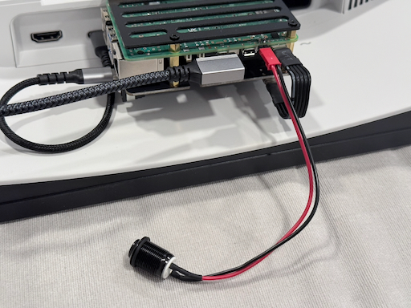

**What it does:**

| Monitor State | Press        | Action                                                                                                       |
| ------------- | ------------ | ------------------------------------------------------------------------------------------------------------ |
| On            | Single press | `buttond` toggles wake/sleep via the control socket                                                          |
| On            | Double press | Executes the configured shutdown command (`systemctl poweroff`)                                              |
| On            | Long hold    | Bypassed in software — Pi 5 firmware forces a hardware power-off (works even if the software is unresponsive) |
| Off           | Press        | Powers Pi on                                                                                                 |

**Skipping the button:** leave J2 unwired and use SSH commands (see [Operate](operate.md)) or an `awake-schedule` (see [Configure](configure.md)) instead. The default `buttond` config has `device: null`, which skips evdev enumeration.

---

## Physical assembly

The reference build uses a French cleat for mounting, a 3D-printed Pi bracket on the rear of the monitor, and a wooden shadow box around the panel. CAD/laser files live in `../maker/`:

| File                                                                           | Purpose                                                  |
| ------------------------------------------------------------------------------ | -------------------------------------------------------- |
| [`../maker/cleat-spacers.scad`](../maker/cleat-spacers.scad) / `.stl` / `.3mf` | French cleat spacer blocks (3D print)                    |
| [`../maker/cleat-drill-template.svg`](../maker/cleat-drill-template.svg)       | Drill template for the cleat bolt pattern                |
| [`../maker/pi5_bracket.svg`](../maker/pi5_bracket.svg)                         | Laser-cut bracket for mounting the Pi 5 to VESA hardware |

### Target hardware

- VESA pattern: 100×100 mm, M4 thread with shallow ~10 mm engagement
- Bolt length must clear the full stack — wood cleat + spacer + bracket — while still engaging the VESA thread (this build uses M4 × 40 mm)
- Spacer blocks raise cleat hardware 6 mm off the shell to prevent crushing

### Tools

| Tool                  | Notes                                                                                                                                 |
| --------------------- | ------------------------------------------------------------------------------------------------------------------------------------- |
| 3D printer (FDM)      | Cleat spacers, optional Pi bracket. Print in PETG — these are load-bearing, and PLA can creep under sustained load near a warm panel. |
| Laser cutter          | Required for the Pi bracket — the mounting holes need tighter tolerance than hand tools hold.                                         |
| Drill + bits          | M4 clearance for VESA, pilot holes for cleat                                                                                          |
| Pocket-screw jig      | Frame joints; wood screws are a fallback                                                                                              |
| Miter or circular saw | Shadow-box lumber                                                                                                                     |

### Steps

The photos throughout this section are from the reference build — a deep frame around a 27″ Dell S2725QC, with a birch-plywood box, an oak face frame, and the Pi hung off the monitor's VESA mount on a French cleat. Treat them as one worked instance of the general steps, not the only way.

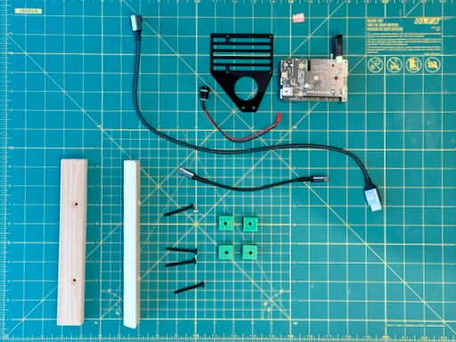

**1. Print the cleat spacers.** Slice `cleat-spacers.3mf` (or the STL) in PETG at 0.2 mm layer height, 40%+ infill, no supports. They sit between the cleat hardware and the monitor's rear shell so clamping force is distributed and the plastic doesn't crush.

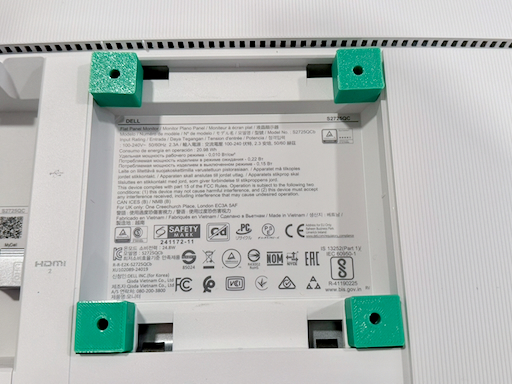

**2. Mount the French cleat.** Print `cleat-drill-template.svg` at 100% scale and verify 100×100 mm spacing against your monitor before drilling. Install M4 × 40 mm flat-head cap screws through the cleat and spacers into the VESA holes, engaging ~10 mm of VESA thread — snug, not tight. Confirm the monitor hangs plumb on the receiver before finalizing.

For the wall-side receiver, span at least one stud. In the reference build the wall cleat is over 16″ long to land on a stud, with the far end carried by a 50 lb butterfly drywall anchor; the plaster patch covers a first outlet location that was blocked by a second stud inches from the anchor.

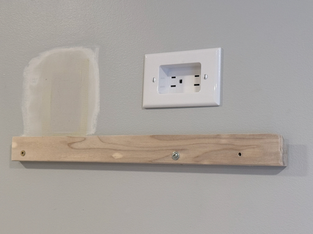

**3. Mount the Raspberry Pi.** Laser-cut `pi5_bracket.svg` from 3 mm acrylic — the M2.5 mounting holes have to land on the Pi's hole pattern precisely, which hand-drilling won't hold. Mount the Pi on the bracket with M2.5 standoffs, and orient it so the USB-C and micro-HDMI ports face the cable routing path.

Stack the power hat over the fan on the standoffs, and — if you're adding the button — solder the 2-pin header to the J2 power pads now (see [Power button wiring](#power-button-wiring)).

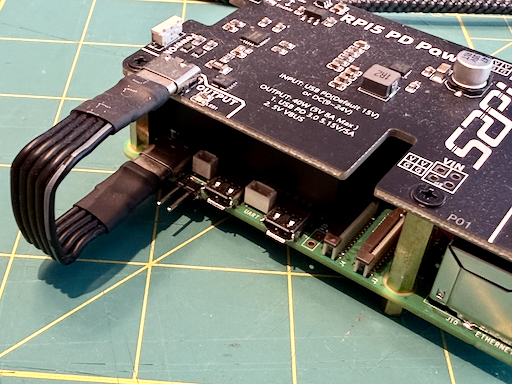

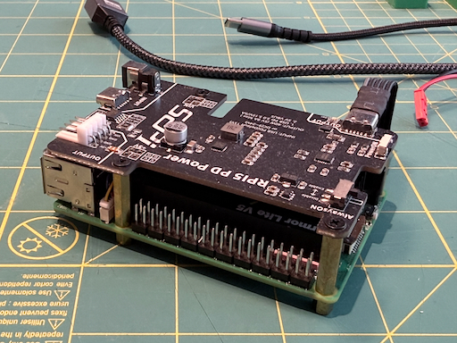

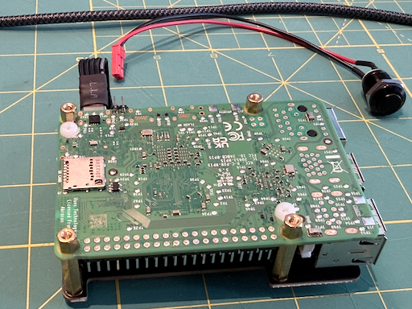

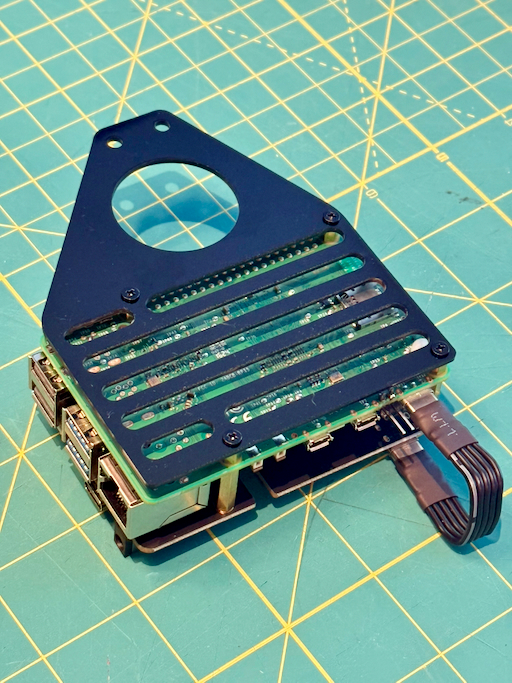

The bracket then screws to the cleat spacer through pre-drilled pilot holes, so the whole Pi assembly rides on the monitor's VESA cleat.

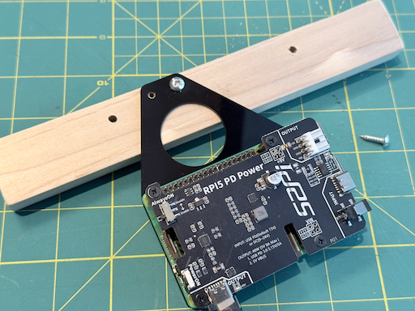

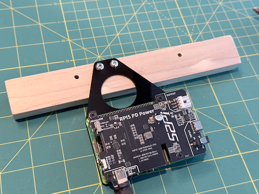

**4. Build the shadow box.** A shallow wooden frame around the monitor that conceals the Pi, cables, and hardware.

- **Depth:** Determine the wall-to-front-of-monitor distance and subtract approximately 0.5" for ventilation.
- **Construction:** 3/4-inch birch plywood with pocket screws at corners; wood glue.
- **Finish:** Matte black for the shadow box and paint or stain of choice for the face frame.

_As built:_ a birch-plywood box behind an oak face frame. The box is made from 2.625″-wide plywood strips; target inside dimensions 24 1/16″ × 14″, each cut ~1/16″ oversize for a snug fit, with two pocket screws and glue per joint. The face frame is ripped from ¼″ × 3.5″ oak into ¼″ × 1.625″ strips (one 48″ length yields a full frame); target inside opening 23½″ × 13¼″.

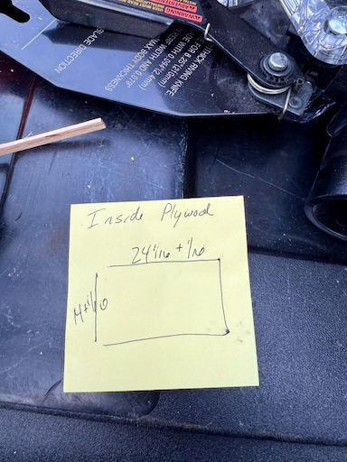

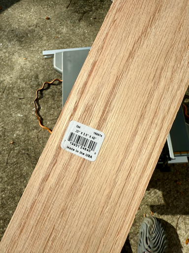

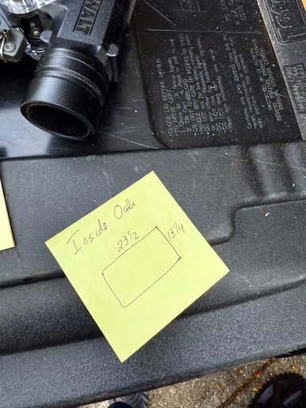

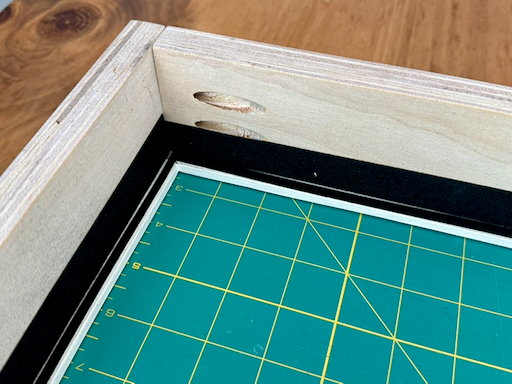

Line the face-frame back and the plywood sides with thin strips cut from 2″ adhesive felt — it protects the monitor's face and edges and gives a snug fit.

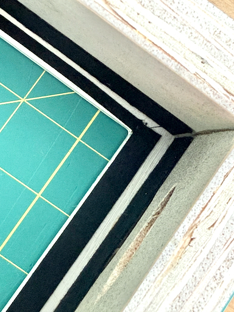

Drill the cross member to clear the monitor's speakers and vents. The button hole gets a larger counterbore on the inside to recess its retaining nut; the larger holes are sized and placed to line up with the panel's existing vents and speakers.

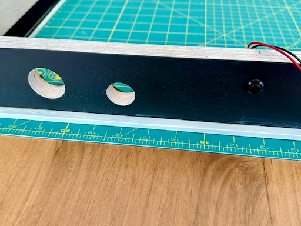

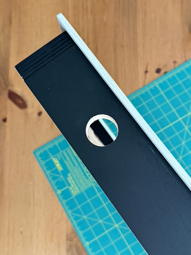

The finished box stands ½″ off the wall, leaving a continuous gap behind the frame for convective airflow:

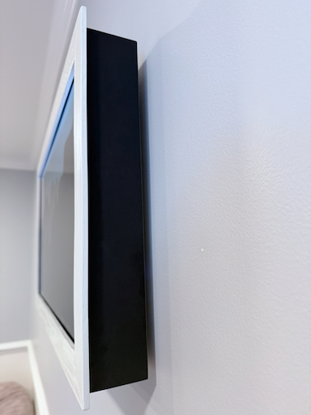

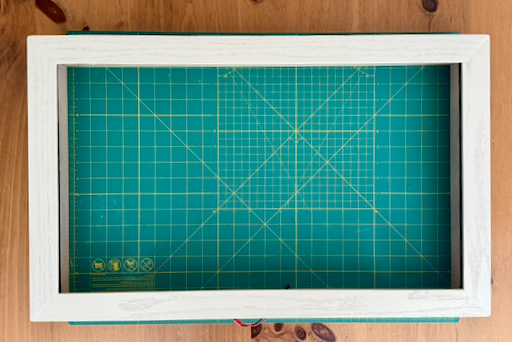

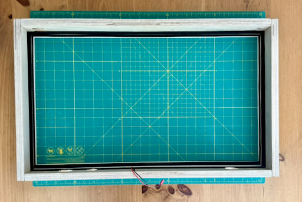

**5. Cable management.**

- **HDMI:** short, high-quality micro-HDMI to HDMI. A right-angle micro-HDMI connector at the Pi is critical — it keeps the cable from side-loading the fragile micro-HDMI port.
- **USB-C power:** short, high-quality cable.
- **Button wire (if present):** route from J2 to the button cutout. A 2-pin JST or dupont connector at the Pi end makes service easy.

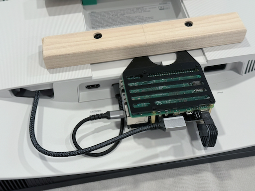

The monitor's own power cord is easiest to dress _after_ the cleat engages the wall — resting the excess on top of the upper cleat is cleaner than threading it between the cleats.

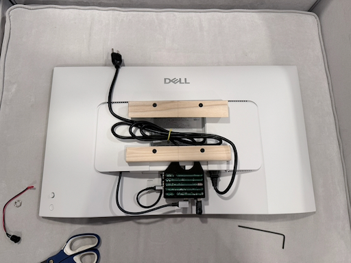

**6. Final assembly.** With the Pi, cleat, and cables mounted to the monitor, hang it on the wall cleat and confirm it boots to the desktop, then fit the wooden frame over the panel. After installing the [software](install.md) and letting the slideshow run ~30 minutes, check temperatures over SSH with `vcgencmd measure_temp` — it should stay well under 80°C. Also sweep an infrared thermometer across several spots on the wall behind the frame to confirm no hot spots are building up in the enclosure. If anything climbs, widen the wall gap or improve airflow before leaving the frame unattended.

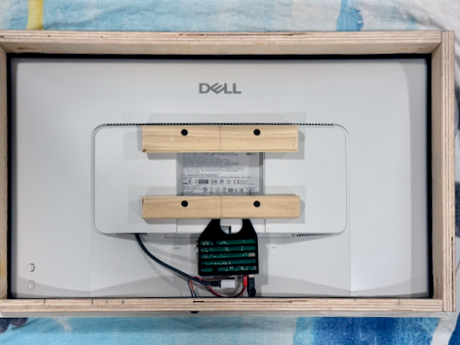

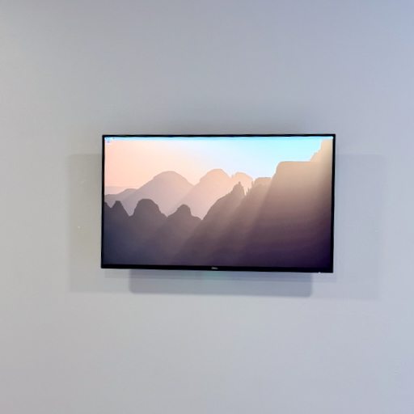

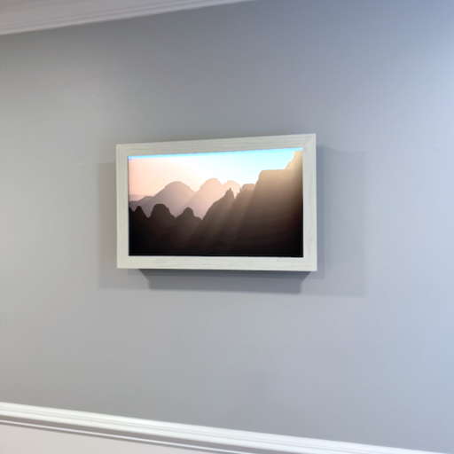

---

## Finished build

With the software running, the frame shows a brief greeting while the first photos warm up, and a sleep card before it powers the panel down.

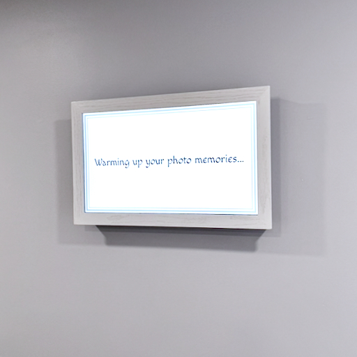

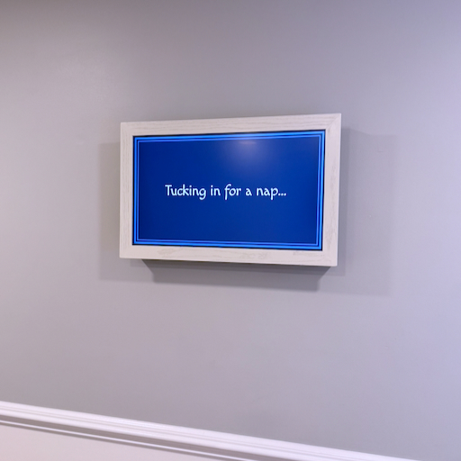

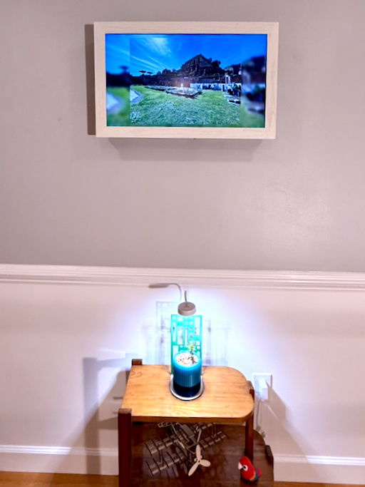

---

## Assembly checklist

- [ ] Cleat spacers printed and fit-checked on VESA holes
- [ ] French cleat mounted; monitor hangs plumb
- [ ] Pi bracket cut and Pi mounted
- [ ] HDMI connected with a right-angle micro-HDMI at the Pi
- [ ] USB-C power connected
- [ ] Button wire routed (if using)
- [ ] Shadow box built; ½″ wall gap for airflow
- [ ] Software fully installed and tested
- [ ] Thermal check passed
